## Base.Address

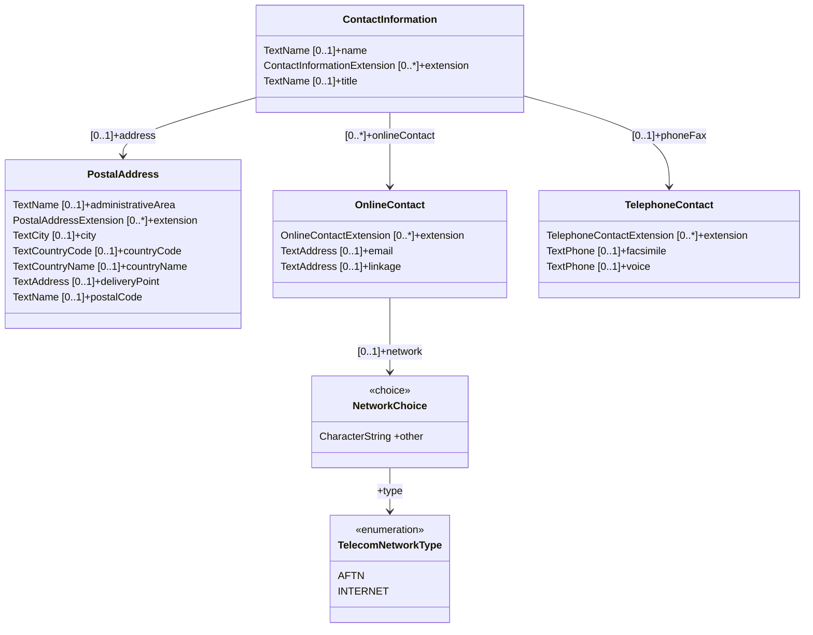
```mermaid
classDiagram
class TelecomNetworkType
<<enumeration>> TelecomNetworkType
TelecomNetworkType : AFTN
TelecomNetworkType : INTERNET
link TelecomNetworkType "https://www.fixm.aero/releases/FIXM-4.2.0/doc/schema_documentation/Fixm_TelecomNetworkTypeType.html" "Go to XML definition"
class PostalAddress
PostalAddress : TextName [0..1]+administrativeArea
PostalAddress : PostalAddressExtension [0..*]+extension
PostalAddress : TextCity [0..1]+city
PostalAddress : TextCountryCode [0..1]+countryCode
PostalAddress : TextCountryName [0..1]+countryName
PostalAddress : TextAddress [0..1]+deliveryPoint
PostalAddress : TextName [0..1]+postalCode
link PostalAddress "https://www.fixm.aero/releases/FIXM-4.2.0/doc/schema_documentation/Fixm_PostalAddressType.html" "Go to XML definition"
class OnlineContact
OnlineContact : OnlineContactExtension [0..*]+extension
OnlineContact : TextAddress [0..1]+email
OnlineContact : TextAddress [0..1]+linkage
OnlineContact --> NetworkChoice : [0..1]+network
link OnlineContact "https://www.fixm.aero/releases/FIXM-4.2.0/doc/schema_documentation/Fixm_OnlineContactType.html" "Go to XML definition"
class ContactInformation
ContactInformation : TextName [0..1]+name
ContactInformation : ContactInformationExtension [0..*]+extension
ContactInformation --> PostalAddress : [0..1]+address
ContactInformation --> OnlineContact : [0..*]+onlineContact
ContactInformation --> TelephoneContact : [0..1]+phoneFax
ContactInformation : TextName [0..1]+title
link ContactInformation "https://www.fixm.aero/releases/FIXM-4.2.0/doc/schema_documentation/Fixm_ContactInformationType.html" "Go to XML definition"
class TelephoneContact
TelephoneContact : TelephoneContactExtension [0..*]+extension
TelephoneContact : TextPhone [0..1]+facsimile
TelephoneContact : TextPhone [0..1]+voice
link TelephoneContact "https://www.fixm.aero/releases/FIXM-4.2.0/doc/schema_documentation/Fixm_TelephoneContactType.html" "Go to XML definition"
class NetworkChoice
<<choice>> NetworkChoice
NetworkChoice : CharacterString +other
NetworkChoice --> TelecomNetworkType : +type
link NetworkChoice "https://www.fixm.aero/releases/FIXM-4.2.0/doc/schema_documentation/Fixm_NetworkChoiceType.html" "Go to XML definition"
```

## Base.AeronauticalReference - ATS Routes references

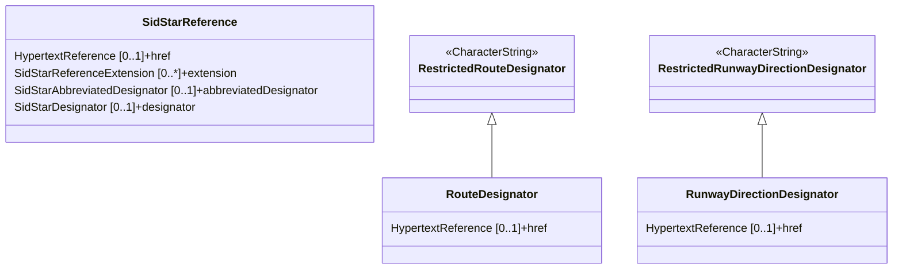
```mermaid
classDiagram
class SidStarReference
SidStarReference : HypertextReference [0..1]+href
SidStarReference : SidStarReferenceExtension [0..*]+extension
SidStarReference : SidStarAbbreviatedDesignator [0..1]+abbreviatedDesignator
SidStarReference : SidStarDesignator [0..1]+designator
link SidStarReference "https://www.fixm.aero/releases/FIXM-4.2.0/doc/schema_documentation/Fixm_SidStarReferenceType.html" "Go to XML definition"
class RestrictedRouteDesignator
link RestrictedRouteDesignator "https://www.fixm.aero/releases/FIXM-4.2.0/doc/schema_documentation/Fixm_RestrictedRouteDesignatorType.html" "Go to XML definition"
class RouteDesignator
RouteDesignator : HypertextReference [0..1]+href
link RouteDesignator "https://www.fixm.aero/releases/FIXM-4.2.0/doc/schema_documentation/Fixm_RouteDesignatorType.html" "Go to XML definition"
class RestrictedRunwayDirectionDesignator
link RestrictedRunwayDirectionDesignator "https://www.fixm.aero/releases/FIXM-4.2.0/doc/schema_documentation/Fixm_RestrictedRunwayDirectionDesignatorType.html" "Go to XML definition"
class RunwayDirectionDesignator
RunwayDirectionDesignator : HypertextReference [0..1]+href
link RunwayDirectionDesignator "https://www.fixm.aero/releases/FIXM-4.2.0/doc/schema_documentation/Fixm_RunwayDirectionDesignatorType.html" "Go to XML definition"
<<CharacterString>>RestrictedRouteDesignator
RestrictedRouteDesignator <|-- RouteDesignator
<<CharacterString>>RestrictedRunwayDirectionDesignator
RestrictedRunwayDirectionDesignator <|-- RunwayDirectionDesignator
```

## Base.AeronauticalReference - Other

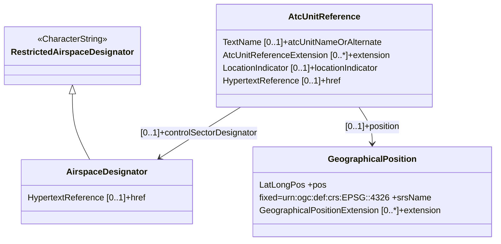
```mermaid
classDiagram
class GeographicalPosition
GeographicalPosition : LatLongPos +pos
GeographicalPosition : fixed#61;urn#58;ogc#58;def#58;crs#58;EPSG#58;#58;4326 +srsName
GeographicalPosition : GeographicalPositionExtension [0..*]+extension
link GeographicalPosition "https://www.fixm.aero/releases/FIXM-4.2.0/doc/schema_documentation/Fixm_GeographicalPositionType.html" "Go to XML definition"
class RestrictedAirspaceDesignator
link RestrictedAirspaceDesignator "https://www.fixm.aero/releases/FIXM-4.2.0/doc/schema_documentation/Fixm_RestrictedAirspaceDesignatorType.html" "Go to XML definition"
class AirspaceDesignator
AirspaceDesignator : HypertextReference [0..1]+href
link AirspaceDesignator "https://www.fixm.aero/releases/FIXM-4.2.0/doc/schema_documentation/Fixm_AirspaceDesignatorType.html" "Go to XML definition"
class AtcUnitReference
AtcUnitReference : TextName [0..1]+atcUnitNameOrAlternate
AtcUnitReference --> AirspaceDesignator : [0..1]+controlSectorDesignator
AtcUnitReference : AtcUnitReferenceExtension [0..*]+extension
AtcUnitReference : LocationIndicator [0..1]+locationIndicator
AtcUnitReference --> GeographicalPosition : [0..1]+position
AtcUnitReference : HypertextReference [0..1]+href
link AtcUnitReference "https://www.fixm.aero/releases/FIXM-4.2.0/doc/schema_documentation/Fixm_AtcUnitReferenceType.html" "Go to XML definition"
<<CharacterString>>RestrictedAirspaceDesignator
RestrictedAirspaceDesignator <|-- AirspaceDesignator
```

## Base.AeronauticalReference - SignificantPoint

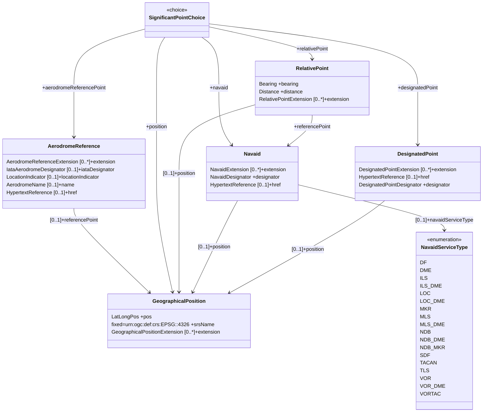
```mermaid
classDiagram
class DesignatedPoint
DesignatedPoint : DesignatedPointExtension [0..*]+extension
DesignatedPoint : HypertextReference [0..1]+href
DesignatedPoint : DesignatedPointDesignator +designator
DesignatedPoint --> GeographicalPosition : [0..1]+position
link DesignatedPoint "https://www.fixm.aero/releases/FIXM-4.2.0/doc/schema_documentation/Fixm_DesignatedPointType.html" "Go to XML definition"
class GeographicalPosition
GeographicalPosition : LatLongPos +pos
GeographicalPosition : fixed#61;urn#58;ogc#58;def#58;crs#58;EPSG#58;#58;4326 +srsName
GeographicalPosition : GeographicalPositionExtension [0..*]+extension
link GeographicalPosition "https://www.fixm.aero/releases/FIXM-4.2.0/doc/schema_documentation/Fixm_GeographicalPositionType.html" "Go to XML definition"
class Navaid
Navaid : NavaidExtension [0..*]+extension
Navaid : NavaidDesignator +designator
Navaid : HypertextReference [0..1]+href
Navaid --> NavaidServiceType : [0..1]+navaidServiceType
Navaid --> GeographicalPosition : [0..1]+position
link Navaid "https://www.fixm.aero/releases/FIXM-4.2.0/doc/schema_documentation/Fixm_NavaidType.html" "Go to XML definition"
class RelativePoint
RelativePoint : Bearing +bearing
RelativePoint : Distance +distance
RelativePoint : RelativePointExtension [0..*]+extension
RelativePoint --> GeographicalPosition : [0..1]+position
RelativePoint --> Navaid : +referencePoint
link RelativePoint "https://www.fixm.aero/releases/FIXM-4.2.0/doc/schema_documentation/Fixm_RelativePointType.html" "Go to XML definition"
class SignificantPointChoice
<<choice>> SignificantPointChoice
SignificantPointChoice --> AerodromeReference : +aerodromeReferencePoint
SignificantPointChoice --> DesignatedPoint : +designatedPoint
SignificantPointChoice --> Navaid : +navaid
SignificantPointChoice --> GeographicalPosition : +position
SignificantPointChoice --> RelativePoint : +relativePoint
link SignificantPointChoice "https://www.fixm.aero/releases/FIXM-4.2.0/doc/schema_documentation/Fixm_SignificantPointChoiceType.html" "Go to XML definition"
class NavaidServiceType
<<enumeration>> NavaidServiceType
NavaidServiceType : DF
NavaidServiceType : DME
NavaidServiceType : ILS
NavaidServiceType : ILS_DME
NavaidServiceType : LOC
NavaidServiceType : LOC_DME
NavaidServiceType : MKR
NavaidServiceType : MLS
NavaidServiceType : MLS_DME
NavaidServiceType : NDB
NavaidServiceType : NDB_DME
NavaidServiceType : NDB_MKR
NavaidServiceType : SDF
NavaidServiceType : TACAN
NavaidServiceType : TLS
NavaidServiceType : VOR
NavaidServiceType : VOR_DME
NavaidServiceType : VORTAC
link NavaidServiceType "https://www.fixm.aero/releases/FIXM-4.2.0/doc/schema_documentation/Fixm_NavaidServiceTypeType.html" "Go to XML definition"
class AerodromeReference
AerodromeReference : AerodromeReferenceExtension [0..*]+extension
AerodromeReference : IataAerodromeDesignator [0..1]+iataDesignator
AerodromeReference : LocationIndicator [0..1]+locationIndicator
AerodromeReference : AerodromeName [0..1]+name
AerodromeReference --> GeographicalPosition : [0..1]+referencePoint
AerodromeReference : HypertextReference [0..1]+href
link AerodromeReference "https://www.fixm.aero/releases/FIXM-4.2.0/doc/schema_documentation/Fixm_AerodromeReferenceType.html" "Go to XML definition"
```

## Base.Measures - Angles

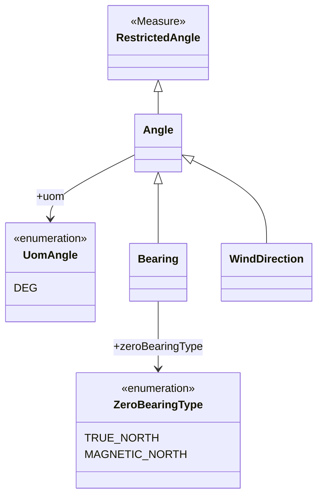
```mermaid
classDiagram
class Angle
Angle --> UomAngle : +uom
link Angle "https://www.fixm.aero/releases/FIXM-4.2.0/doc/schema_documentation/Fixm_AngleType.html" "Go to XML definition"
class Bearing
Bearing --> ZeroBearingType : +zeroBearingType
link Bearing "https://www.fixm.aero/releases/FIXM-4.2.0/doc/schema_documentation/Fixm_BearingType.html" "Go to XML definition"
class WindDirection
link WindDirection "https://www.fixm.aero/releases/FIXM-4.2.0/doc/schema_documentation/Fixm_WindDirectionType.html" "Go to XML definition"
class ZeroBearingType
<<enumeration>> ZeroBearingType
ZeroBearingType : TRUE_NORTH
ZeroBearingType : MAGNETIC_NORTH
link ZeroBearingType "https://www.fixm.aero/releases/FIXM-4.2.0/doc/schema_documentation/Fixm_ZeroBearingTypeType.html" "Go to XML definition"
class RestrictedAngle
link RestrictedAngle "https://www.fixm.aero/releases/FIXM-4.2.0/doc/schema_documentation/Fixm_RestrictedAngleType.html" "Go to XML definition"
class UomAngle
<<enumeration>> UomAngle
UomAngle : DEG
link UomAngle "https://www.fixm.aero/releases/FIXM-4.2.0/doc/schema_documentation/Fixm_UomAngleType.html" "Go to XML definition"
RestrictedAngle <|-- Angle
Angle <|-- Bearing
Angle <|-- WindDirection
<<Measure>>RestrictedAngle
```

## Base.Measures - Other

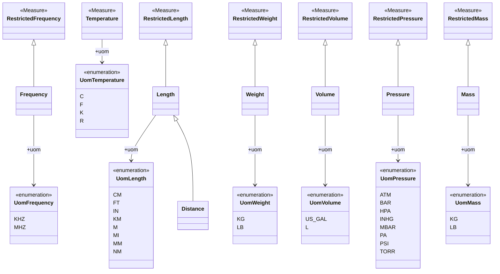
```mermaid
classDiagram
class Pressure
Pressure --> UomPressure : +uom
link Pressure "https://www.fixm.aero/releases/FIXM-4.2.0/doc/schema_documentation/Fixm_PressureType.html" "Go to XML definition"
class Temperature
Temperature --> UomTemperature : +uom
link Temperature "https://www.fixm.aero/releases/FIXM-4.2.0/doc/schema_documentation/Fixm_TemperatureType.html" "Go to XML definition"
class RestrictedFrequency
link RestrictedFrequency "https://www.fixm.aero/releases/FIXM-4.2.0/doc/schema_documentation/Fixm_RestrictedFrequencyType.html" "Go to XML definition"
class RestrictedLength
link RestrictedLength "https://www.fixm.aero/releases/FIXM-4.2.0/doc/schema_documentation/Fixm_RestrictedLengthType.html" "Go to XML definition"
class RestrictedWeight
link RestrictedWeight "https://www.fixm.aero/releases/FIXM-4.2.0/doc/schema_documentation/Fixm_RestrictedWeightType.html" "Go to XML definition"
class RestrictedVolume
link RestrictedVolume "https://www.fixm.aero/releases/FIXM-4.2.0/doc/schema_documentation/Fixm_RestrictedVolumeType.html" "Go to XML definition"
class RestrictedPressure
link RestrictedPressure "https://www.fixm.aero/releases/FIXM-4.2.0/doc/schema_documentation/Fixm_RestrictedPressureType.html" "Go to XML definition"
class RestrictedMass
link RestrictedMass "https://www.fixm.aero/releases/FIXM-4.2.0/doc/schema_documentation/Fixm_RestrictedMassType.html" "Go to XML definition"
class Mass
Mass --> UomMass : +uom
link Mass "https://www.fixm.aero/releases/FIXM-4.2.0/doc/schema_documentation/Fixm_MassType.html" "Go to XML definition"
class UomLength
<<enumeration>> UomLength
UomLength : CM
UomLength : FT
UomLength : IN
UomLength : KM
UomLength : M
UomLength : MI
UomLength : MM
UomLength : NM
link UomLength "https://www.fixm.aero/releases/FIXM-4.2.0/doc/schema_documentation/Fixm_UomLengthType.html" "Go to XML definition"
class UomPressure
<<enumeration>> UomPressure
UomPressure : ATM
UomPressure : BAR
UomPressure : HPA
UomPressure : INHG
UomPressure : MBAR
UomPressure : PA
UomPressure : PSI
UomPressure : TORR
link UomPressure "https://www.fixm.aero/releases/FIXM-4.2.0/doc/schema_documentation/Fixm_UomPressureType.html" "Go to XML definition"
class UomTemperature
<<enumeration>> UomTemperature
UomTemperature : C
UomTemperature : F
UomTemperature : K
UomTemperature : R
link UomTemperature "https://www.fixm.aero/releases/FIXM-4.2.0/doc/schema_documentation/Fixm_UomTemperatureType.html" "Go to XML definition"
class UomVolume
<<enumeration>> UomVolume
UomVolume : US_GAL
UomVolume : L
link UomVolume "https://www.fixm.aero/releases/FIXM-4.2.0/doc/schema_documentation/Fixm_UomVolumeType.html" "Go to XML definition"
class UomFrequency
<<enumeration>> UomFrequency
UomFrequency : KHZ
UomFrequency : MHZ
link UomFrequency "https://www.fixm.aero/releases/FIXM-4.2.0/doc/schema_documentation/Fixm_UomFrequencyType.html" "Go to XML definition"
class UomMass
<<enumeration>> UomMass
UomMass : KG
UomMass : LB
link UomMass "https://www.fixm.aero/releases/FIXM-4.2.0/doc/schema_documentation/Fixm_UomMassType.html" "Go to XML definition"
class UomWeight
<<enumeration>> UomWeight
UomWeight : KG
UomWeight : LB
link UomWeight "https://www.fixm.aero/releases/FIXM-4.2.0/doc/schema_documentation/Fixm_UomWeightType.html" "Go to XML definition"
class Volume
Volume --> UomVolume : +uom
link Volume "https://www.fixm.aero/releases/FIXM-4.2.0/doc/schema_documentation/Fixm_VolumeType.html" "Go to XML definition"
class Distance
link Distance "https://www.fixm.aero/releases/FIXM-4.2.0/doc/schema_documentation/Fixm_DistanceType.html" "Go to XML definition"
class Frequency
Frequency --> UomFrequency : +uom
link Frequency "https://www.fixm.aero/releases/FIXM-4.2.0/doc/schema_documentation/Fixm_FrequencyType.html" "Go to XML definition"
class Length
Length --> UomLength : +uom
link Length "https://www.fixm.aero/releases/FIXM-4.2.0/doc/schema_documentation/Fixm_LengthType.html" "Go to XML definition"
class Weight
Weight --> UomWeight : +uom
link Weight "https://www.fixm.aero/releases/FIXM-4.2.0/doc/schema_documentation/Fixm_WeightType.html" "Go to XML definition"
RestrictedPressure <|-- Pressure
<<Measure>>Temperature
<<Measure>>RestrictedFrequency
<<Measure>>RestrictedLength
<<Measure>>RestrictedWeight
<<Measure>>RestrictedVolume
<<Measure>>RestrictedPressure
<<Measure>>RestrictedMass
RestrictedMass <|-- Mass
RestrictedVolume <|-- Volume
Length <|-- Distance
RestrictedFrequency <|-- Frequency
RestrictedLength <|-- Length
RestrictedWeight <|-- Weight
```

## Base.Measures - Speed Types

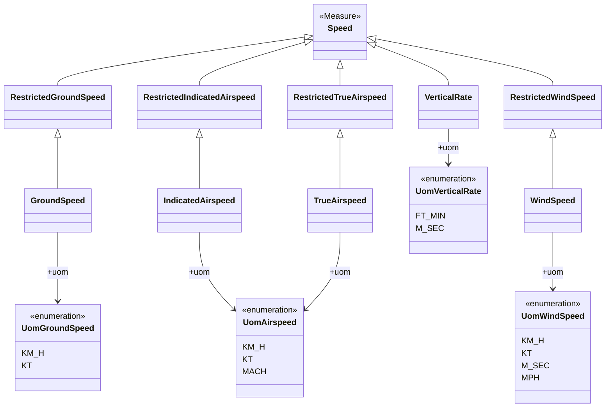
```mermaid
classDiagram
class Speed
link Speed "https://www.fixm.aero/releases/FIXM-4.2.0/doc/schema_documentation/Fixm_SpeedType.html" "Go to XML definition"
class GroundSpeed
GroundSpeed --> UomGroundSpeed : +uom
link GroundSpeed "https://www.fixm.aero/releases/FIXM-4.2.0/doc/schema_documentation/Fixm_GroundSpeedType.html" "Go to XML definition"
class IndicatedAirspeed
IndicatedAirspeed --> UomAirspeed : +uom
link IndicatedAirspeed "https://www.fixm.aero/releases/FIXM-4.2.0/doc/schema_documentation/Fixm_IndicatedAirspeedType.html" "Go to XML definition"
class TrueAirspeed
TrueAirspeed --> UomAirspeed : +uom
link TrueAirspeed "https://www.fixm.aero/releases/FIXM-4.2.0/doc/schema_documentation/Fixm_TrueAirspeedType.html" "Go to XML definition"
class VerticalRate
VerticalRate --> UomVerticalRate : +uom
link VerticalRate "https://www.fixm.aero/releases/FIXM-4.2.0/doc/schema_documentation/Fixm_VerticalRateType.html" "Go to XML definition"
class WindSpeed
WindSpeed --> UomWindSpeed : +uom
link WindSpeed "https://www.fixm.aero/releases/FIXM-4.2.0/doc/schema_documentation/Fixm_WindSpeedType.html" "Go to XML definition"
class RestrictedGroundSpeed
link RestrictedGroundSpeed "https://www.fixm.aero/releases/FIXM-4.2.0/doc/schema_documentation/Fixm_RestrictedGroundSpeedType.html" "Go to XML definition"
class RestrictedIndicatedAirspeed
link RestrictedIndicatedAirspeed "https://www.fixm.aero/releases/FIXM-4.2.0/doc/schema_documentation/Fixm_RestrictedIndicatedAirspeedType.html" "Go to XML definition"
class RestrictedTrueAirspeed
link RestrictedTrueAirspeed "https://www.fixm.aero/releases/FIXM-4.2.0/doc/schema_documentation/Fixm_RestrictedTrueAirspeedType.html" "Go to XML definition"
class RestrictedWindSpeed
link RestrictedWindSpeed "https://www.fixm.aero/releases/FIXM-4.2.0/doc/schema_documentation/Fixm_RestrictedWindSpeedType.html" "Go to XML definition"
class UomWindSpeed
<<enumeration>> UomWindSpeed
UomWindSpeed : KM_H
UomWindSpeed : KT
UomWindSpeed : M_SEC
UomWindSpeed : MPH
link UomWindSpeed "https://www.fixm.aero/releases/FIXM-4.2.0/doc/schema_documentation/Fixm_UomWindSpeedType.html" "Go to XML definition"
class UomAirspeed
<<enumeration>> UomAirspeed
UomAirspeed : KM_H
UomAirspeed : KT
UomAirspeed : MACH
link UomAirspeed "https://www.fixm.aero/releases/FIXM-4.2.0/doc/schema_documentation/Fixm_UomAirspeedType.html" "Go to XML definition"
class UomGroundSpeed
<<enumeration>> UomGroundSpeed
UomGroundSpeed : KM_H
UomGroundSpeed : KT
link UomGroundSpeed "https://www.fixm.aero/releases/FIXM-4.2.0/doc/schema_documentation/Fixm_UomGroundSpeedType.html" "Go to XML definition"
class UomVerticalRate
<<enumeration>> UomVerticalRate
UomVerticalRate : FT_MIN
UomVerticalRate : M_SEC
link UomVerticalRate "https://www.fixm.aero/releases/FIXM-4.2.0/doc/schema_documentation/Fixm_UomVerticalRateType.html" "Go to XML definition"
<<Measure>>Speed
RestrictedGroundSpeed <|-- GroundSpeed
RestrictedIndicatedAirspeed <|-- IndicatedAirspeed
RestrictedTrueAirspeed <|-- TrueAirspeed
Speed <|-- VerticalRate
RestrictedWindSpeed <|-- WindSpeed
Speed <|-- RestrictedGroundSpeed
Speed <|-- RestrictedIndicatedAirspeed
Speed <|-- RestrictedTrueAirspeed
Speed <|-- RestrictedWindSpeed
```

## Base.Measures - Vertical Distances

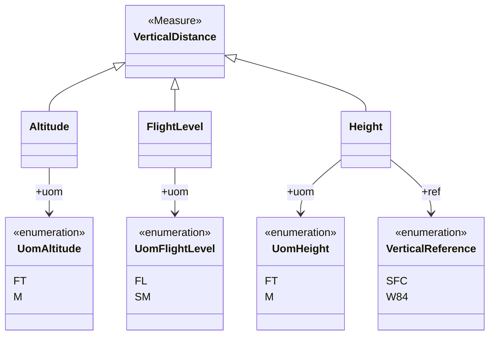
```mermaid
classDiagram
class UomHeight
<<enumeration>> UomHeight
UomHeight : FT
UomHeight : M
link UomHeight "https://www.fixm.aero/releases/FIXM-4.2.0/doc/schema_documentation/Fixm_UomHeightType.html" "Go to XML definition"
class VerticalDistance
link VerticalDistance "https://www.fixm.aero/releases/FIXM-4.2.0/doc/schema_documentation/Fixm_VerticalDistanceType.html" "Go to XML definition"
class Altitude
Altitude --> UomAltitude : +uom
link Altitude "https://www.fixm.aero/releases/FIXM-4.2.0/doc/schema_documentation/Fixm_AltitudeType.html" "Go to XML definition"
class FlightLevel
FlightLevel --> UomFlightLevel : +uom
link FlightLevel "https://www.fixm.aero/releases/FIXM-4.2.0/doc/schema_documentation/Fixm_FlightLevelType.html" "Go to XML definition"
class Height
Height --> UomHeight : +uom
Height --> VerticalReference : +ref
link Height "https://www.fixm.aero/releases/FIXM-4.2.0/doc/schema_documentation/Fixm_HeightType.html" "Go to XML definition"
class VerticalReference
<<enumeration>> VerticalReference
VerticalReference : SFC
VerticalReference : W84
link VerticalReference "https://www.fixm.aero/releases/FIXM-4.2.0/doc/schema_documentation/Fixm_VerticalReferenceType.html" "Go to XML definition"
class UomAltitude
<<enumeration>> UomAltitude
UomAltitude : FT
UomAltitude : M
link UomAltitude "https://www.fixm.aero/releases/FIXM-4.2.0/doc/schema_documentation/Fixm_UomAltitudeType.html" "Go to XML definition"
class UomFlightLevel
<<enumeration>> UomFlightLevel
UomFlightLevel : FL
UomFlightLevel : SM
link UomFlightLevel "https://www.fixm.aero/releases/FIXM-4.2.0/doc/schema_documentation/Fixm_UomFlightLevelType.html" "Go to XML definition"
<<Measure>>VerticalDistance
VerticalDistance <|-- Altitude
VerticalDistance <|-- FlightLevel
VerticalDistance <|-- Height
```

## Base.Organization

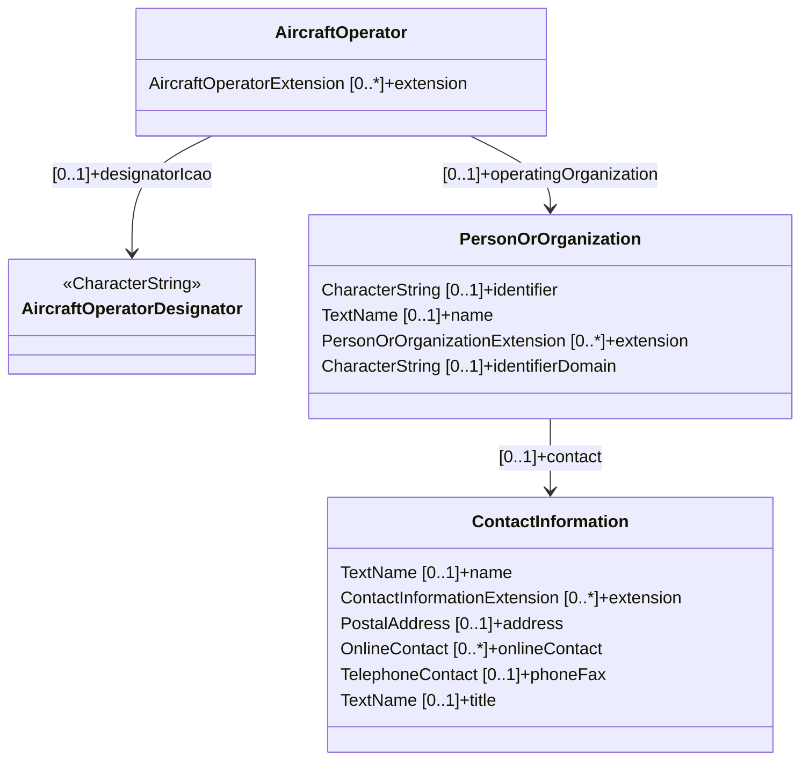
```mermaid
classDiagram
class AircraftOperatorDesignator
link AircraftOperatorDesignator "https://www.fixm.aero/releases/FIXM-4.2.0/doc/schema_documentation/Fixm_AircraftOperatorDesignatorType.html" "Go to XML definition"
class AircraftOperator
AircraftOperator : AircraftOperatorExtension [0..*]+extension
AircraftOperator --> AircraftOperatorDesignator : [0..1]+designatorIcao
AircraftOperator --> PersonOrOrganization : [0..1]+operatingOrganization
link AircraftOperator "https://www.fixm.aero/releases/FIXM-4.2.0/doc/schema_documentation/Fixm_AircraftOperatorType.html" "Go to XML definition"
class PersonOrOrganization
PersonOrOrganization : CharacterString [0..1]+identifier
PersonOrOrganization : TextName [0..1]+name
PersonOrOrganization : PersonOrOrganizationExtension [0..*]+extension
PersonOrOrganization : CharacterString [0..1]+identifierDomain
PersonOrOrganization --> ContactInformation : [0..1]+contact
link PersonOrOrganization "https://www.fixm.aero/releases/FIXM-4.2.0/doc/schema_documentation/Fixm_PersonOrOrganizationType.html" "Go to XML definition"
class ContactInformation
ContactInformation : TextName [0..1]+name
ContactInformation : ContactInformationExtension [0..*]+extension
ContactInformation : PostalAddress [0..1]+address
ContactInformation : OnlineContact [0..*]+onlineContact
ContactInformation : TelephoneContact [0..1]+phoneFax
ContactInformation : TextName [0..1]+title
link ContactInformation "https://www.fixm.aero/releases/FIXM-4.2.0/doc/schema_documentation/Fixm_ContactInformationType.html" "Go to XML definition"
<<CharacterString>>AircraftOperatorDesignator
```

## Base.RangesAndChoices

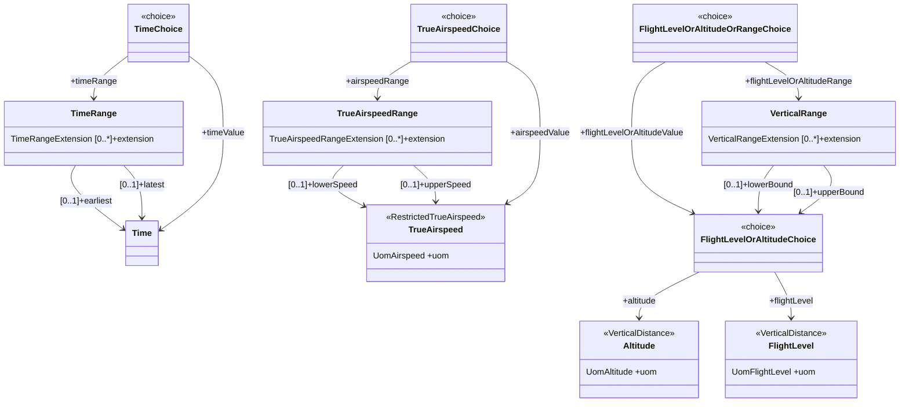
```mermaid
classDiagram
class TimeRange
TimeRange --> Time : [0..1]+earliest
TimeRange --> Time : [0..1]+latest
TimeRange : TimeRangeExtension [0..*]+extension
link TimeRange "https://www.fixm.aero/releases/FIXM-4.2.0/doc/schema_documentation/Fixm_TimeRangeType.html" "Go to XML definition"
class TimeChoice
<<choice>> TimeChoice
TimeChoice --> TimeRange : +timeRange
TimeChoice --> Time : +timeValue
link TimeChoice "https://www.fixm.aero/releases/FIXM-4.2.0/doc/schema_documentation/Fixm_TimeChoiceType.html" "Go to XML definition"
class Time
link Time "https://www.fixm.aero/releases/FIXM-4.2.0/doc/schema_documentation/Fixm_TimeType.html" "Go to XML definition"
class TrueAirspeed
TrueAirspeed : UomAirspeed +uom
link TrueAirspeed "https://www.fixm.aero/releases/FIXM-4.2.0/doc/schema_documentation/Fixm_TrueAirspeedType.html" "Go to XML definition"
class TrueAirspeedRange
TrueAirspeedRange --> TrueAirspeed : [0..1]+lowerSpeed
TrueAirspeedRange --> TrueAirspeed : [0..1]+upperSpeed
TrueAirspeedRange : TrueAirspeedRangeExtension [0..*]+extension
link TrueAirspeedRange "https://www.fixm.aero/releases/FIXM-4.2.0/doc/schema_documentation/Fixm_TrueAirspeedRangeType.html" "Go to XML definition"
class TrueAirspeedChoice
<<choice>> TrueAirspeedChoice
TrueAirspeedChoice --> TrueAirspeedRange : +airspeedRange
TrueAirspeedChoice --> TrueAirspeed : +airspeedValue
link TrueAirspeedChoice "https://www.fixm.aero/releases/FIXM-4.2.0/doc/schema_documentation/Fixm_TrueAirspeedChoiceType.html" "Go to XML definition"
class FlightLevel
FlightLevel : UomFlightLevel +uom
link FlightLevel "https://www.fixm.aero/releases/FIXM-4.2.0/doc/schema_documentation/Fixm_FlightLevelType.html" "Go to XML definition"
class Altitude
Altitude : UomAltitude +uom
link Altitude "https://www.fixm.aero/releases/FIXM-4.2.0/doc/schema_documentation/Fixm_AltitudeType.html" "Go to XML definition"
class FlightLevelOrAltitudeChoice
<<choice>> FlightLevelOrAltitudeChoice
FlightLevelOrAltitudeChoice --> Altitude : +altitude
FlightLevelOrAltitudeChoice --> FlightLevel : +flightLevel
link FlightLevelOrAltitudeChoice "https://www.fixm.aero/releases/FIXM-4.2.0/doc/schema_documentation/Fixm_FlightLevelOrAltitudeChoiceType.html" "Go to XML definition"
class FlightLevelOrAltitudeOrRangeChoice
<<choice>> FlightLevelOrAltitudeOrRangeChoice
FlightLevelOrAltitudeOrRangeChoice --> VerticalRange : +flightLevelOrAltitudeRange
FlightLevelOrAltitudeOrRangeChoice --> FlightLevelOrAltitudeChoice : +flightLevelOrAltitudeValue
link FlightLevelOrAltitudeOrRangeChoice "https://www.fixm.aero/releases/FIXM-4.2.0/doc/schema_documentation/Fixm_FlightLevelOrAltitudeOrRangeChoiceType.html" "Go to XML definition"
class VerticalRange
VerticalRange : VerticalRangeExtension [0..*]+extension
VerticalRange --> FlightLevelOrAltitudeChoice : [0..1]+lowerBound
VerticalRange --> FlightLevelOrAltitudeChoice : [0..1]+upperBound
link VerticalRange "https://www.fixm.aero/releases/FIXM-4.2.0/doc/schema_documentation/Fixm_VerticalRangeType.html" "Go to XML definition"
<<RestrictedTrueAirspeed>>TrueAirspeed
<<VerticalDistance>>FlightLevel
<<VerticalDistance>>Altitude
```

## Flight.Aircraft

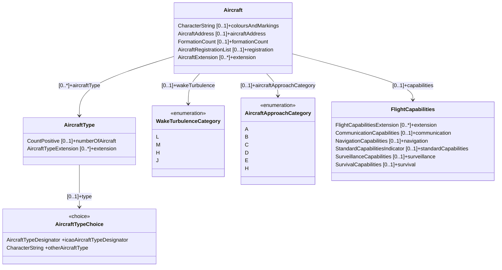
```mermaid
classDiagram
class AircraftType
AircraftType : CountPositive [0..1]+numberOfAircraft
AircraftType : AircraftTypeExtension [0..*]+extension
AircraftType --> AircraftTypeChoice : [0..1]+type
link AircraftType "https://www.fixm.aero/releases/FIXM-4.2.0/doc/schema_documentation/Fixm_AircraftTypeType.html" "Go to XML definition"
class WakeTurbulenceCategory
<<enumeration>> WakeTurbulenceCategory
WakeTurbulenceCategory : L
WakeTurbulenceCategory : M
WakeTurbulenceCategory : H
WakeTurbulenceCategory : J
link WakeTurbulenceCategory "https://www.fixm.aero/releases/FIXM-4.2.0/doc/schema_documentation/Fixm_WakeTurbulenceCategoryType.html" "Go to XML definition"
class AircraftApproachCategory
<<enumeration>> AircraftApproachCategory
AircraftApproachCategory : A
AircraftApproachCategory : B
AircraftApproachCategory : C
AircraftApproachCategory : D
AircraftApproachCategory : E
AircraftApproachCategory : H
link AircraftApproachCategory "https://www.fixm.aero/releases/FIXM-4.2.0/doc/schema_documentation/Fixm_AircraftApproachCategoryType.html" "Go to XML definition"
class AircraftTypeChoice
<<choice>> AircraftTypeChoice
AircraftTypeChoice : AircraftTypeDesignator +icaoAircraftTypeDesignator
AircraftTypeChoice : CharacterString +otherAircraftType
link AircraftTypeChoice "https://www.fixm.aero/releases/FIXM-4.2.0/doc/schema_documentation/Fixm_AircraftTypeChoiceType.html" "Go to XML definition"
class Aircraft
Aircraft : CharacterString [0..1]+coloursAndMarkings
Aircraft : AircraftAddress [0..1]+aircraftAddress
Aircraft --> AircraftApproachCategory : [0..1]+aircraftApproachCategory
Aircraft --> AircraftType : [0..*]+aircraftType
Aircraft --> FlightCapabilities : [0..1]+capabilities
Aircraft : FormationCount [0..1]+formationCount
Aircraft : AircraftRegistrationList [0..1]+registration
Aircraft --> WakeTurbulenceCategory : [0..1]+wakeTurbulence
Aircraft : AircraftExtension [0..*]+extension
link Aircraft "https://www.fixm.aero/releases/FIXM-4.2.0/doc/schema_documentation/Fixm_AircraftType.html" "Go to XML definition"
class FlightCapabilities
FlightCapabilities : FlightCapabilitiesExtension [0..*]+extension
FlightCapabilities : CommunicationCapabilities [0..1]+communication
FlightCapabilities : NavigationCapabilities [0..1]+navigation
FlightCapabilities : StandardCapabilitiesIndicator [0..1]+standardCapabilities
FlightCapabilities : SurveillanceCapabilities [0..1]+surveillance
FlightCapabilities : SurvivalCapabilities [0..1]+survival
link FlightCapabilities "https://www.fixm.aero/releases/FIXM-4.2.0/doc/schema_documentation/Fixm_FlightCapabilitiesType.html" "Go to XML definition"
```

## Flight.Arrival

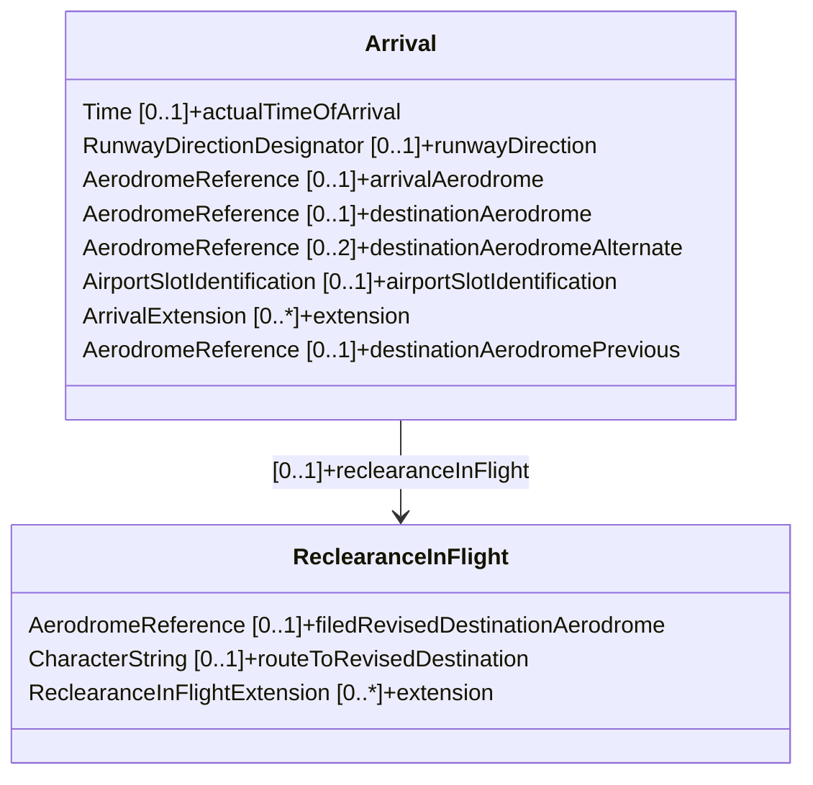
```mermaid
classDiagram
class Arrival
Arrival : Time [0..1]+actualTimeOfArrival
Arrival : RunwayDirectionDesignator [0..1]+runwayDirection
Arrival : AerodromeReference [0..1]+arrivalAerodrome
Arrival : AerodromeReference [0..1]+destinationAerodrome
Arrival : AerodromeReference [0..2]+destinationAerodromeAlternate
Arrival : AirportSlotIdentification [0..1]+airportSlotIdentification
Arrival : ArrivalExtension [0..*]+extension
Arrival : AerodromeReference [0..1]+destinationAerodromePrevious
Arrival --> ReclearanceInFlight : [0..1]+reclearanceInFlight
link Arrival "https://www.fixm.aero/releases/FIXM-4.2.0/doc/schema_documentation/Fixm_ArrivalType.html" "Go to XML definition"
class ReclearanceInFlight
ReclearanceInFlight : AerodromeReference [0..1]+filedRevisedDestinationAerodrome
ReclearanceInFlight : CharacterString [0..1]+routeToRevisedDestination
ReclearanceInFlight : ReclearanceInFlightExtension [0..*]+extension
link ReclearanceInFlight "https://www.fixm.aero/releases/FIXM-4.2.0/doc/schema_documentation/Fixm_ReclearanceInFlightType.html" "Go to XML definition"
```

## Flight.Capability - CNS

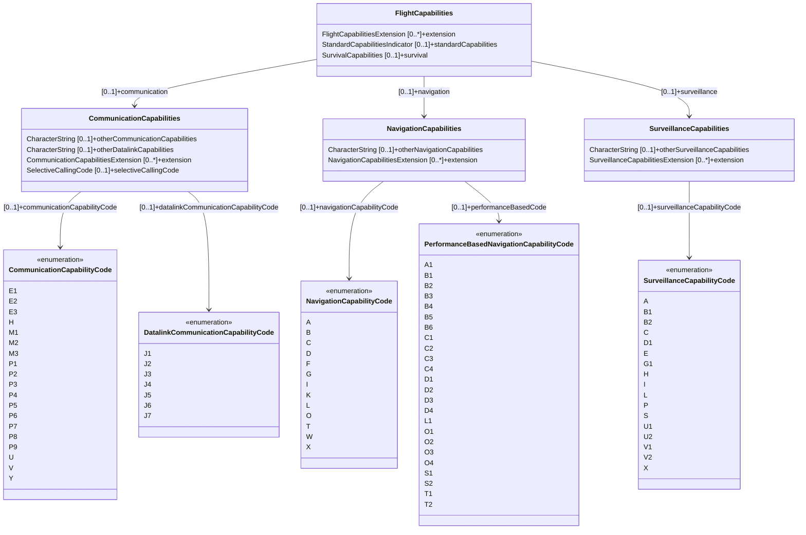
```mermaid
classDiagram
class CommunicationCapabilities
CommunicationCapabilities : CharacterString [0..1]+otherCommunicationCapabilities
CommunicationCapabilities : CharacterString [0..1]+otherDatalinkCapabilities
CommunicationCapabilities : CommunicationCapabilitiesExtension [0..*]+extension
CommunicationCapabilities --> "<List>" CommunicationCapabilityCode : [0..1]+communicationCapabilityCode
CommunicationCapabilities --> "<List>" DatalinkCommunicationCapabilityCode : [0..1]+datalinkCommunicationCapabilityCode
CommunicationCapabilities : SelectiveCallingCode [0..1]+selectiveCallingCode
link CommunicationCapabilities "https://www.fixm.aero/releases/FIXM-4.2.0/doc/schema_documentation/Fixm_CommunicationCapabilitiesType.html" "Go to XML definition"
class DatalinkCommunicationCapabilityCode
<<enumeration>> DatalinkCommunicationCapabilityCode
DatalinkCommunicationCapabilityCode : J1
DatalinkCommunicationCapabilityCode : J2
DatalinkCommunicationCapabilityCode : J3
DatalinkCommunicationCapabilityCode : J4
DatalinkCommunicationCapabilityCode : J5
DatalinkCommunicationCapabilityCode : J6
DatalinkCommunicationCapabilityCode : J7
link DatalinkCommunicationCapabilityCode "https://www.fixm.aero/releases/FIXM-4.2.0/doc/schema_documentation/Fixm_DatalinkCommunicationCapabilityCodeType.html" "Go to XML definition"
class CommunicationCapabilityCode
<<enumeration>> CommunicationCapabilityCode
CommunicationCapabilityCode : E1
CommunicationCapabilityCode : E2
CommunicationCapabilityCode : E3
CommunicationCapabilityCode : H
CommunicationCapabilityCode : M1
CommunicationCapabilityCode : M2
CommunicationCapabilityCode : M3
CommunicationCapabilityCode : P1
CommunicationCapabilityCode : P2
CommunicationCapabilityCode : P3
CommunicationCapabilityCode : P4
CommunicationCapabilityCode : P5
CommunicationCapabilityCode : P6
CommunicationCapabilityCode : P7
CommunicationCapabilityCode : P8
CommunicationCapabilityCode : P9
CommunicationCapabilityCode : U
CommunicationCapabilityCode : V
CommunicationCapabilityCode : Y
link CommunicationCapabilityCode "https://www.fixm.aero/releases/FIXM-4.2.0/doc/schema_documentation/Fixm_CommunicationCapabilityCodeType.html" "Go to XML definition"
class SurveillanceCapabilities
SurveillanceCapabilities : CharacterString [0..1]+otherSurveillanceCapabilities
SurveillanceCapabilities : SurveillanceCapabilitiesExtension [0..*]+extension
SurveillanceCapabilities --> "<List>" SurveillanceCapabilityCode : [0..1]+surveillanceCapabilityCode
link SurveillanceCapabilities "https://www.fixm.aero/releases/FIXM-4.2.0/doc/schema_documentation/Fixm_SurveillanceCapabilitiesType.html" "Go to XML definition"
class SurveillanceCapabilityCode
<<enumeration>> SurveillanceCapabilityCode
SurveillanceCapabilityCode : A
SurveillanceCapabilityCode : B1
SurveillanceCapabilityCode : B2
SurveillanceCapabilityCode : C
SurveillanceCapabilityCode : D1
SurveillanceCapabilityCode : E
SurveillanceCapabilityCode : G1
SurveillanceCapabilityCode : H
SurveillanceCapabilityCode : I
SurveillanceCapabilityCode : L
SurveillanceCapabilityCode : P
SurveillanceCapabilityCode : S
SurveillanceCapabilityCode : U1
SurveillanceCapabilityCode : U2
SurveillanceCapabilityCode : V1
SurveillanceCapabilityCode : V2
SurveillanceCapabilityCode : X
link SurveillanceCapabilityCode "https://www.fixm.aero/releases/FIXM-4.2.0/doc/schema_documentation/Fixm_SurveillanceCapabilityCodeType.html" "Go to XML definition"
class NavigationCapabilities
NavigationCapabilities : CharacterString [0..1]+otherNavigationCapabilities
NavigationCapabilities : NavigationCapabilitiesExtension [0..*]+extension
NavigationCapabilities --> "<List>" NavigationCapabilityCode : [0..1]+navigationCapabilityCode
NavigationCapabilities --> "<List>" PerformanceBasedNavigationCapabilityCode : [0..1]+performanceBasedCode
link NavigationCapabilities "https://www.fixm.aero/releases/FIXM-4.2.0/doc/schema_documentation/Fixm_NavigationCapabilitiesType.html" "Go to XML definition"
class NavigationCapabilityCode
<<enumeration>> NavigationCapabilityCode
NavigationCapabilityCode : A
NavigationCapabilityCode : B
NavigationCapabilityCode : C
NavigationCapabilityCode : D
NavigationCapabilityCode : F
NavigationCapabilityCode : G
NavigationCapabilityCode : I
NavigationCapabilityCode : K
NavigationCapabilityCode : L
NavigationCapabilityCode : O
NavigationCapabilityCode : T
NavigationCapabilityCode : W
NavigationCapabilityCode : X
link NavigationCapabilityCode "https://www.fixm.aero/releases/FIXM-4.2.0/doc/schema_documentation/Fixm_NavigationCapabilityCodeType.html" "Go to XML definition"
class PerformanceBasedNavigationCapabilityCode
<<enumeration>> PerformanceBasedNavigationCapabilityCode
PerformanceBasedNavigationCapabilityCode : A1
PerformanceBasedNavigationCapabilityCode : B1
PerformanceBasedNavigationCapabilityCode : B2
PerformanceBasedNavigationCapabilityCode : B3
PerformanceBasedNavigationCapabilityCode : B4
PerformanceBasedNavigationCapabilityCode : B5
PerformanceBasedNavigationCapabilityCode : B6
PerformanceBasedNavigationCapabilityCode : C1
PerformanceBasedNavigationCapabilityCode : C2
PerformanceBasedNavigationCapabilityCode : C3
PerformanceBasedNavigationCapabilityCode : C4
PerformanceBasedNavigationCapabilityCode : D1
PerformanceBasedNavigationCapabilityCode : D2
PerformanceBasedNavigationCapabilityCode : D3
PerformanceBasedNavigationCapabilityCode : D4
PerformanceBasedNavigationCapabilityCode : L1
PerformanceBasedNavigationCapabilityCode : O1
PerformanceBasedNavigationCapabilityCode : O2
PerformanceBasedNavigationCapabilityCode : O3
PerformanceBasedNavigationCapabilityCode : O4
PerformanceBasedNavigationCapabilityCode : S1
PerformanceBasedNavigationCapabilityCode : S2
PerformanceBasedNavigationCapabilityCode : T1
PerformanceBasedNavigationCapabilityCode : T2
link PerformanceBasedNavigationCapabilityCode "https://www.fixm.aero/releases/FIXM-4.2.0/doc/schema_documentation/Fixm_PerformanceBasedNavigationCapabilityCodeType.html" "Go to XML definition"
class FlightCapabilities
FlightCapabilities : FlightCapabilitiesExtension [0..*]+extension
FlightCapabilities --> CommunicationCapabilities : [0..1]+communication
FlightCapabilities --> NavigationCapabilities : [0..1]+navigation
FlightCapabilities : StandardCapabilitiesIndicator [0..1]+standardCapabilities
FlightCapabilities --> SurveillanceCapabilities : [0..1]+surveillance
FlightCapabilities : SurvivalCapabilities [0..1]+survival
link FlightCapabilities "https://www.fixm.aero/releases/FIXM-4.2.0/doc/schema_documentation/Fixm_FlightCapabilitiesType.html" "Go to XML definition"
```

## Flight.Capability - Survival

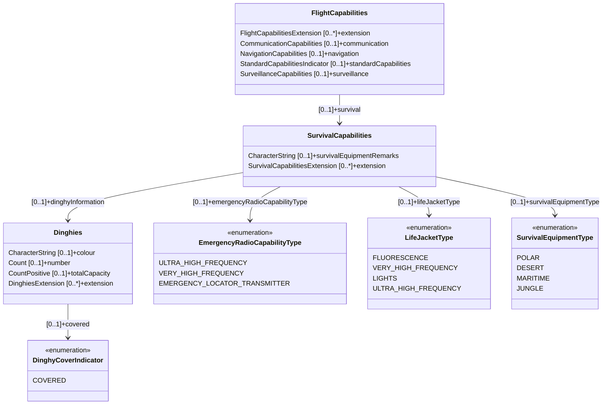
```mermaid
classDiagram
class Dinghies
Dinghies : CharacterString [0..1]+colour
Dinghies : Count [0..1]+number
Dinghies : CountPositive [0..1]+totalCapacity
Dinghies : DinghiesExtension [0..*]+extension
Dinghies --> DinghyCoverIndicator : [0..1]+covered
link Dinghies "https://www.fixm.aero/releases/FIXM-4.2.0/doc/schema_documentation/Fixm_DinghiesType.html" "Go to XML definition"
class SurvivalCapabilities
SurvivalCapabilities : CharacterString [0..1]+survivalEquipmentRemarks
SurvivalCapabilities : SurvivalCapabilitiesExtension [0..*]+extension
SurvivalCapabilities --> Dinghies : [0..1]+dinghyInformation
SurvivalCapabilities --> "<List>" EmergencyRadioCapabilityType : [0..1]+emergencyRadioCapabilityType
SurvivalCapabilities --> "<List>" LifeJacketType : [0..1]+lifeJacketType
SurvivalCapabilities --> "<List>" SurvivalEquipmentType : [0..1]+survivalEquipmentType
link SurvivalCapabilities "https://www.fixm.aero/releases/FIXM-4.2.0/doc/schema_documentation/Fixm_SurvivalCapabilitiesType.html" "Go to XML definition"
class SurvivalEquipmentType
<<enumeration>> SurvivalEquipmentType
SurvivalEquipmentType : POLAR
SurvivalEquipmentType : DESERT
SurvivalEquipmentType : MARITIME
SurvivalEquipmentType : JUNGLE
link SurvivalEquipmentType "https://www.fixm.aero/releases/FIXM-4.2.0/doc/schema_documentation/Fixm_SurvivalEquipmentTypeType.html" "Go to XML definition"
class EmergencyRadioCapabilityType
<<enumeration>> EmergencyRadioCapabilityType
EmergencyRadioCapabilityType : ULTRA_HIGH_FREQUENCY
EmergencyRadioCapabilityType : VERY_HIGH_FREQUENCY
EmergencyRadioCapabilityType : EMERGENCY_LOCATOR_TRANSMITTER
link EmergencyRadioCapabilityType "https://www.fixm.aero/releases/FIXM-4.2.0/doc/schema_documentation/Fixm_EmergencyRadioCapabilityTypeType.html" "Go to XML definition"
class LifeJacketType
<<enumeration>> LifeJacketType
LifeJacketType : FLUORESCENCE
LifeJacketType : VERY_HIGH_FREQUENCY
LifeJacketType : LIGHTS
LifeJacketType : ULTRA_HIGH_FREQUENCY
link LifeJacketType "https://www.fixm.aero/releases/FIXM-4.2.0/doc/schema_documentation/Fixm_LifeJacketTypeType.html" "Go to XML definition"
class DinghyCoverIndicator
<<enumeration>> DinghyCoverIndicator
DinghyCoverIndicator : COVERED
link DinghyCoverIndicator "https://www.fixm.aero/releases/FIXM-4.2.0/doc/schema_documentation/Fixm_DinghyCoverIndicatorType.html" "Go to XML definition"
class FlightCapabilities
FlightCapabilities : FlightCapabilitiesExtension [0..*]+extension
FlightCapabilities : CommunicationCapabilities [0..1]+communication
FlightCapabilities : NavigationCapabilities [0..1]+navigation
FlightCapabilities : StandardCapabilitiesIndicator [0..1]+standardCapabilities
FlightCapabilities : SurveillanceCapabilities [0..1]+surveillance
FlightCapabilities --> SurvivalCapabilities : [0..1]+survival
link FlightCapabilities "https://www.fixm.aero/releases/FIXM-4.2.0/doc/schema_documentation/Fixm_FlightCapabilitiesType.html" "Go to XML definition"
```

## Flight.Constraints

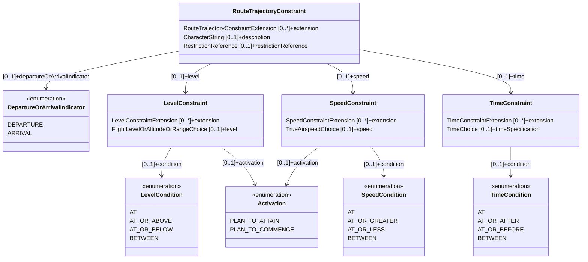
```mermaid
classDiagram
class TimeCondition
<<enumeration>> TimeCondition
TimeCondition : AT
TimeCondition : AT_OR_AFTER
TimeCondition : AT_OR_BEFORE
TimeCondition : BETWEEN
link TimeCondition "https://www.fixm.aero/releases/FIXM-4.2.0/doc/schema_documentation/Fixm_TimeConditionType.html" "Go to XML definition"
class LevelCondition
<<enumeration>> LevelCondition
LevelCondition : AT
LevelCondition : AT_OR_ABOVE
LevelCondition : AT_OR_BELOW
LevelCondition : BETWEEN
link LevelCondition "https://www.fixm.aero/releases/FIXM-4.2.0/doc/schema_documentation/Fixm_LevelConditionType.html" "Go to XML definition"
class Activation
<<enumeration>> Activation
Activation : PLAN_TO_ATTAIN
Activation : PLAN_TO_COMMENCE
link Activation "https://www.fixm.aero/releases/FIXM-4.2.0/doc/schema_documentation/Fixm_ActivationType.html" "Go to XML definition"
class SpeedCondition
<<enumeration>> SpeedCondition
SpeedCondition : AT
SpeedCondition : AT_OR_GREATER
SpeedCondition : AT_OR_LESS
SpeedCondition : BETWEEN
link SpeedCondition "https://www.fixm.aero/releases/FIXM-4.2.0/doc/schema_documentation/Fixm_SpeedConditionType.html" "Go to XML definition"
class DepartureOrArrivalIndicator
<<enumeration>> DepartureOrArrivalIndicator
DepartureOrArrivalIndicator : DEPARTURE
DepartureOrArrivalIndicator : ARRIVAL
link DepartureOrArrivalIndicator "https://www.fixm.aero/releases/FIXM-4.2.0/doc/schema_documentation/Fixm_DepartureOrArrivalIndicatorType.html" "Go to XML definition"
class RouteTrajectoryConstraint
RouteTrajectoryConstraint : RouteTrajectoryConstraintExtension [0..*]+extension
RouteTrajectoryConstraint : CharacterString [0..1]+description
RouteTrajectoryConstraint : RestrictionReference [0..1]+restrictionReference
RouteTrajectoryConstraint --> DepartureOrArrivalIndicator : [0..1]+departureOrArrivalIndicator
RouteTrajectoryConstraint --> LevelConstraint : [0..1]+level
RouteTrajectoryConstraint --> SpeedConstraint : [0..1]+speed
RouteTrajectoryConstraint --> TimeConstraint : [0..1]+time
link RouteTrajectoryConstraint "https://www.fixm.aero/releases/FIXM-4.2.0/doc/schema_documentation/Fixm_RouteTrajectoryConstraintType.html" "Go to XML definition"
class TimeConstraint
TimeConstraint : TimeConstraintExtension [0..*]+extension
TimeConstraint : TimeChoice [0..1]+timeSpecification
TimeConstraint --> TimeCondition : [0..1]+condition
link TimeConstraint "https://www.fixm.aero/releases/FIXM-4.2.0/doc/schema_documentation/Fixm_TimeConstraintType.html" "Go to XML definition"
class SpeedConstraint
SpeedConstraint : SpeedConstraintExtension [0..*]+extension
SpeedConstraint : TrueAirspeedChoice [0..1]+speed
SpeedConstraint --> Activation : [0..1]+activation
SpeedConstraint --> SpeedCondition : [0..1]+condition
link SpeedConstraint "https://www.fixm.aero/releases/FIXM-4.2.0/doc/schema_documentation/Fixm_SpeedConstraintType.html" "Go to XML definition"
class LevelConstraint
LevelConstraint : LevelConstraintExtension [0..*]+extension
LevelConstraint : FlightLevelOrAltitudeOrRangeChoice [0..1]+level
LevelConstraint --> Activation : [0..1]+activation
LevelConstraint --> LevelCondition : [0..1]+condition
link LevelConstraint "https://www.fixm.aero/releases/FIXM-4.2.0/doc/schema_documentation/Fixm_LevelConstraintType.html" "Go to XML definition"
```

## Flight.Dangerous Goods

```mermaid
classDiagram
class DangerousGoods
DangerousGoods : DangerousGoodsExtension [0..*]+extension
DangerousGoods : CharacterString [0..1]+onboardLocation
DangerousGoods --> AircraftDangerousGoodsLimitation : [0..1]+aircraftLimitation
DangerousGoods : AirWaybillNumber [0..1]+airWaybillNumber
DangerousGoods --> DangerousGoodsPackageGroup : [0..*]+packageGroup
DangerousGoods --> ShippingInformation : [0..1]+shippingInformation
link DangerousGoods "https://www.fixm.aero/releases/FIXM-4.2.0/doc/schema_documentation/Fixm_DangerousGoodsType.html" "Go to XML definition"
class ShippingInformation
ShippingInformation : ShippingInformationExtension [0..*]+extension
ShippingInformation : CharacterString [0..1]+shipmentAuthorizations
ShippingInformation : CharacterString [0..1]+subsidiaryHazardClassAndDivision
link ShippingInformation "https://www.fixm.aero/releases/FIXM-4.2.0/doc/schema_documentation/Fixm_ShippingInformationType.html" "Go to XML definition"
class DangerousGoodsPackageGroup
DangerousGoodsPackageGroup : DangerousGoodsPackageGroupExtension [0..*]+extension
DangerousGoodsPackageGroup --> DangerousGoodsPackage : [0..*]+dangerousGoodsPackage
DangerousGoodsPackageGroup --> DangerousGoodsDimensions : [0..1]+shipmentDimensions
link DangerousGoodsPackageGroup "https://www.fixm.aero/releases/FIXM-4.2.0/doc/schema_documentation/Fixm_DangerousGoodsPackageGroupType.html" "Go to XML definition"
class AircraftDangerousGoodsLimitation
<<enumeration>> AircraftDangerousGoodsLimitation
AircraftDangerousGoodsLimitation : CARGO_AIRCRAFT_ONLY
AircraftDangerousGoodsLimitation : PASSENGER_AND_CARGO_AIRCRAFT
link AircraftDangerousGoodsLimitation "https://www.fixm.aero/releases/FIXM-4.2.0/doc/schema_documentation/Fixm_AircraftDangerousGoodsLimitationType.html" "Go to XML definition"
class DangerousGoodsPackage
DangerousGoodsPackage : CountPositive [0..1]+dangerousGoodsQuantity
DangerousGoodsPackage : DangerousGoodsPackageExtension [0..*]+extension
DangerousGoodsPackage --> AllPackedInOne : [0..1]+allPackedInOne
DangerousGoodsPackage : CompatibilityGroup [0..1]+compatibilityGroup
DangerousGoodsPackage --> AircraftDangerousGoodsLimitation : [0..1]+dangerousGoodsLimitation
DangerousGoodsPackage --> HazardClass : [0..1]+hazardClass
DangerousGoodsPackage --> PackingGroup : [0..1]+packingGroup
DangerousGoodsPackage --> RadioactiveMaterial : [0..1]+radioactiveMaterials
DangerousGoodsPackage --> DangerousGoodsDimensions : [0..1]+shipmentDimensions
DangerousGoodsPackage --> HazardClass : [0..2]+subsidiaryHazardClass
DangerousGoodsPackage : UnNumber [0..1]+unNumber
DangerousGoodsPackage : CharacterString [0..1]+properShippingName
link DangerousGoodsPackage "https://www.fixm.aero/releases/FIXM-4.2.0/doc/schema_documentation/Fixm_DangerousGoodsPackageType.html" "Go to XML definition"
class DangerousGoodsDimensions
DangerousGoodsDimensions : Weight [0..1]+grossWeight
DangerousGoodsDimensions : Weight [0..1]+netWeight
DangerousGoodsDimensions : Volume [0..1]+volume
DangerousGoodsDimensions : DangerousGoodsDimensionsExtension [0..*]+extension
link DangerousGoodsDimensions "https://www.fixm.aero/releases/FIXM-4.2.0/doc/schema_documentation/Fixm_DangerousGoodsDimensionsType.html" "Go to XML definition"
class AllPackedInOne
AllPackedInOne : CountPositive [0..1]+numberOfPackages
AllPackedInOne : AllPackedInOneExtension [0..*]+extension
link AllPackedInOne "https://www.fixm.aero/releases/FIXM-4.2.0/doc/schema_documentation/Fixm_AllPackedInOneType.html" "Go to XML definition"
class HazardClass
HazardClass : HazardClassExtension [0..*]+extension
HazardClass : RestrictedHazardClass [0..1]+class
HazardClass : HazardDivision [0..1]+division
link HazardClass "https://www.fixm.aero/releases/FIXM-4.2.0/doc/schema_documentation/Fixm_HazardClassType.html" "Go to XML definition"
class RadioactiveMaterial
RadioactiveMaterial : RadioactiveMaterialExtension [0..*]+extension
RadioactiveMaterial --> RadioactiveMaterialCategory : [0..1]+category
RadioactiveMaterial : CriticalSafetyIndex [0..1]+criticalSafetyIndex
RadioactiveMaterial : TransportIndex [0..1]+transportIndex
link RadioactiveMaterial "https://www.fixm.aero/releases/FIXM-4.2.0/doc/schema_documentation/Fixm_RadioactiveMaterialType.html" "Go to XML definition"
class PackingGroup
<<enumeration>> PackingGroup
PackingGroup : I
PackingGroup : II
PackingGroup : III
link PackingGroup "https://www.fixm.aero/releases/FIXM-4.2.0/doc/schema_documentation/Fixm_PackingGroupType.html" "Go to XML definition"
class RadioactiveMaterialCategory
<<enumeration>> RadioactiveMaterialCategory
RadioactiveMaterialCategory : I_WHITE
RadioactiveMaterialCategory : III_YELLOW
RadioactiveMaterialCategory : II_YELLOW
link RadioactiveMaterialCategory "https://www.fixm.aero/releases/FIXM-4.2.0/doc/schema_documentation/Fixm_RadioactiveMaterialCategoryType.html" "Go to XML definition"
```

## Flight.Departure

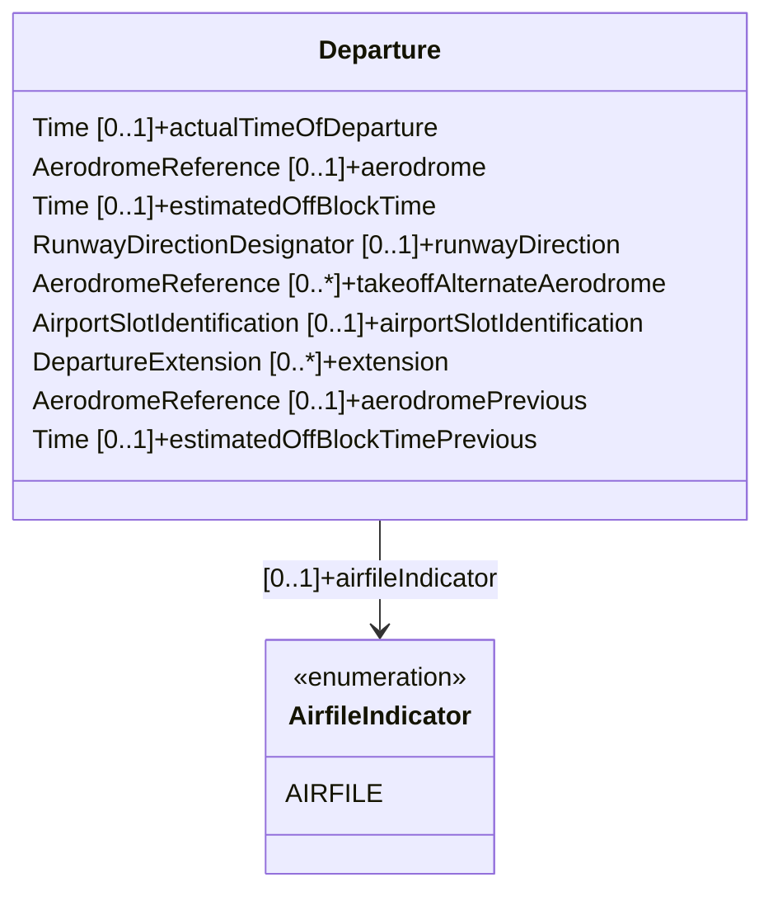
```mermaid
classDiagram
class AirfileIndicator
<<enumeration>> AirfileIndicator
AirfileIndicator : AIRFILE
link AirfileIndicator "https://www.fixm.aero/releases/FIXM-4.2.0/doc/schema_documentation/Fixm_AirfileIndicatorType.html" "Go to XML definition"
class Departure
Departure : Time [0..1]+actualTimeOfDeparture
Departure : AerodromeReference [0..1]+aerodrome
Departure : Time [0..1]+estimatedOffBlockTime
Departure : RunwayDirectionDesignator [0..1]+runwayDirection
Departure : AerodromeReference [0..*]+takeoffAlternateAerodrome
Departure : AirportSlotIdentification [0..1]+airportSlotIdentification
Departure : DepartureExtension [0..*]+extension
Departure : AerodromeReference [0..1]+aerodromePrevious
Departure : Time [0..1]+estimatedOffBlockTimePrevious
Departure --> AirfileIndicator : [0..1]+airfileIndicator
link Departure "https://www.fixm.aero/releases/FIXM-4.2.0/doc/schema_documentation/Fixm_DepartureType.html" "Go to XML definition"
```

## Flight.Emergency

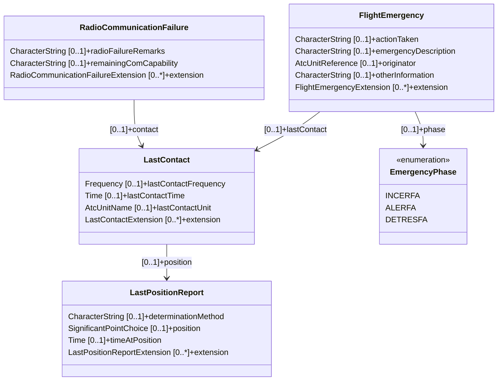
```mermaid
classDiagram
class RadioCommunicationFailure
RadioCommunicationFailure : CharacterString [0..1]+radioFailureRemarks
RadioCommunicationFailure : CharacterString [0..1]+remainingComCapability
RadioCommunicationFailure : RadioCommunicationFailureExtension [0..*]+extension
RadioCommunicationFailure --> LastContact : [0..1]+contact
link RadioCommunicationFailure "https://www.fixm.aero/releases/FIXM-4.2.0/doc/schema_documentation/Fixm_RadioCommunicationFailureType.html" "Go to XML definition"
class LastPositionReport
LastPositionReport : CharacterString [0..1]+determinationMethod
LastPositionReport : SignificantPointChoice [0..1]+position
LastPositionReport : Time [0..1]+timeAtPosition
LastPositionReport : LastPositionReportExtension [0..*]+extension
link LastPositionReport "https://www.fixm.aero/releases/FIXM-4.2.0/doc/schema_documentation/Fixm_LastPositionReportType.html" "Go to XML definition"
class LastContact
LastContact : Frequency [0..1]+lastContactFrequency
LastContact : Time [0..1]+lastContactTime
LastContact : AtcUnitName [0..1]+lastContactUnit
LastContact : LastContactExtension [0..*]+extension
LastContact --> LastPositionReport : [0..1]+position
link LastContact "https://www.fixm.aero/releases/FIXM-4.2.0/doc/schema_documentation/Fixm_LastContactType.html" "Go to XML definition"
class EmergencyPhase
<<enumeration>> EmergencyPhase
EmergencyPhase : INCERFA
EmergencyPhase : ALERFA
EmergencyPhase : DETRESFA
link EmergencyPhase "https://www.fixm.aero/releases/FIXM-4.2.0/doc/schema_documentation/Fixm_EmergencyPhaseType.html" "Go to XML definition"
class FlightEmergency
FlightEmergency : CharacterString [0..1]+actionTaken
FlightEmergency : CharacterString [0..1]+emergencyDescription
FlightEmergency : AtcUnitReference [0..1]+originator
FlightEmergency : CharacterString [0..1]+otherInformation
FlightEmergency : FlightEmergencyExtension [0..*]+extension
FlightEmergency --> LastContact : [0..1]+lastContact
FlightEmergency --> EmergencyPhase : [0..1]+phase
link FlightEmergency "https://www.fixm.aero/releases/FIXM-4.2.0/doc/schema_documentation/Fixm_FlightEmergencyType.html" "Go to XML definition"
```

## Flight.EnRoute

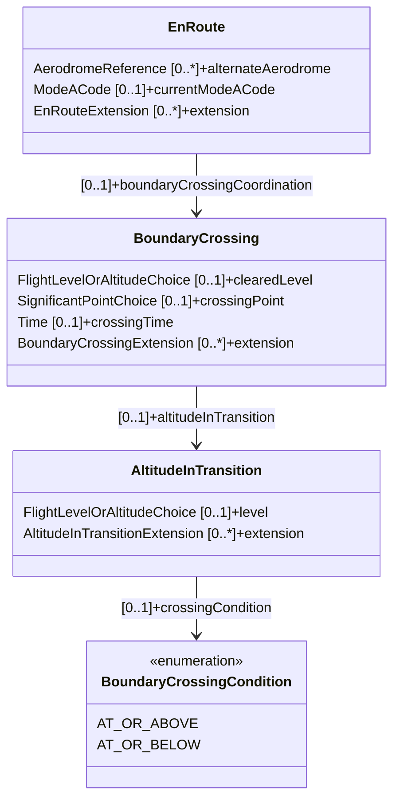
```mermaid
classDiagram
class BoundaryCrossingCondition
<<enumeration>> BoundaryCrossingCondition
BoundaryCrossingCondition : AT_OR_ABOVE
BoundaryCrossingCondition : AT_OR_BELOW
link BoundaryCrossingCondition "https://www.fixm.aero/releases/FIXM-4.2.0/doc/schema_documentation/Fixm_BoundaryCrossingConditionType.html" "Go to XML definition"
class AltitudeInTransition
AltitudeInTransition : FlightLevelOrAltitudeChoice [0..1]+level
AltitudeInTransition : AltitudeInTransitionExtension [0..*]+extension
AltitudeInTransition --> BoundaryCrossingCondition : [0..1]+crossingCondition
link AltitudeInTransition "https://www.fixm.aero/releases/FIXM-4.2.0/doc/schema_documentation/Fixm_AltitudeInTransitionType.html" "Go to XML definition"
class BoundaryCrossing
BoundaryCrossing : FlightLevelOrAltitudeChoice [0..1]+clearedLevel
BoundaryCrossing : SignificantPointChoice [0..1]+crossingPoint
BoundaryCrossing : Time [0..1]+crossingTime
BoundaryCrossing : BoundaryCrossingExtension [0..*]+extension
BoundaryCrossing --> AltitudeInTransition : [0..1]+altitudeInTransition
link BoundaryCrossing "https://www.fixm.aero/releases/FIXM-4.2.0/doc/schema_documentation/Fixm_BoundaryCrossingType.html" "Go to XML definition"
class EnRoute
EnRoute : AerodromeReference [0..*]+alternateAerodrome
EnRoute : ModeACode [0..1]+currentModeACode
EnRoute : EnRouteExtension [0..*]+extension
EnRoute --> BoundaryCrossing : [0..1]+boundaryCrossingCoordination
link EnRoute "https://www.fixm.aero/releases/FIXM-4.2.0/doc/schema_documentation/Fixm_EnRouteType.html" "Go to XML definition"
```

## Flight.FlightData

```mermaid
classDiagram
class Flight
Flight : PersonOrOrganization [0..1]+flightPlanOriginator
Flight : PersonOrOrganization [0..1]+flightPlanSubmitter
Flight : UniversallyUniqueIdentifier [0..1]+gufi
Flight : PersonOrOrganization [0..1]+gufiOriginator
Flight : AircraftOperator [0..1]+operator
Flight : FlightExtension [0..*]+extension
Flight : CharacterString [0..1]+remarks
Flight --> Aircraft : [0..1]+aircraft
Flight --> Arrival : [0..1]+arrival
Flight --> DangerousGoods : [0..*]+dangerousGoods
Flight --> Departure : [0..1]+departure
Flight : FlightEmergency [0..1]+emergency
Flight --> EnRoute : [0..1]+enRoute
Flight --> FlightConstraint : [0..*]+flightConstraint
Flight --> FlightIdentification : [0..1]+flightIdentification
Flight --> TypeOfFlight : [0..1]+flightType
Flight : RadioCommunicationFailure [0..1]+radioCommunicationFailure
Flight --> RouteTrajectoryGroupContainer : [0..1]+routeTrajectoryGroup
Flight --> "<List>" SpecialHandlingReasonCode : [0..1]+specialHandling
Flight --> SupplementaryData : [0..1]+supplementaryData
link Flight "https://www.fixm.aero/releases/FIXM-4.2.0/doc/schema_documentation/Fixm_FlightType.html" "Go to XML definition"
class Departure
Departure : Time [0..1]+actualTimeOfDeparture
Departure : AerodromeReference [0..1]+aerodrome
Departure : Time [0..1]+estimatedOffBlockTime
Departure : RunwayDirectionDesignator [0..1]+runwayDirection
Departure : AerodromeReference [0..*]+takeoffAlternateAerodrome
Departure : AirportSlotIdentification [0..1]+airportSlotIdentification
Departure : DepartureExtension [0..*]+extension
Departure : AerodromeReference [0..1]+aerodromePrevious
Departure : Time [0..1]+estimatedOffBlockTimePrevious
Departure : AirfileIndicator [0..1]+airfileIndicator
link Departure "https://www.fixm.aero/releases/FIXM-4.2.0/doc/schema_documentation/Fixm_DepartureType.html" "Go to XML definition"
class Aircraft
Aircraft : CharacterString [0..1]+coloursAndMarkings
Aircraft : AircraftAddress [0..1]+aircraftAddress
Aircraft : AircraftApproachCategory [0..1]+aircraftApproachCategory
Aircraft : AircraftType [0..*]+aircraftType
Aircraft : FlightCapabilities [0..1]+capabilities
Aircraft : FormationCount [0..1]+formationCount
Aircraft : AircraftRegistrationList [0..1]+registration
Aircraft : WakeTurbulenceCategory [0..1]+wakeTurbulence
Aircraft : AircraftExtension [0..*]+extension
link Aircraft "https://www.fixm.aero/releases/FIXM-4.2.0/doc/schema_documentation/Fixm_AircraftType.html" "Go to XML definition"
class SupplementaryData
SupplementaryData : Duration [0..1]+fuelEndurance
SupplementaryData : Count [0..1]+personsOnBoard
SupplementaryData : PersonOrOrganization [0..1]+pilotInCommand
SupplementaryData : SupplementaryDataExtension [0..*]+extension
SupplementaryData --> SupplementaryDataSourceChoice : [0..1]+supplementaryDataSource
link SupplementaryData "https://www.fixm.aero/releases/FIXM-4.2.0/doc/schema_documentation/Fixm_SupplementaryDataType.html" "Go to XML definition"
class TypeOfFlight
<<enumeration>> TypeOfFlight
TypeOfFlight : M
TypeOfFlight : G
TypeOfFlight : N
TypeOfFlight : S
TypeOfFlight : X
link TypeOfFlight "https://www.fixm.aero/releases/FIXM-4.2.0/doc/schema_documentation/Fixm_TypeOfFlightType.html" "Go to XML definition"
class FlightIdentification
FlightIdentification : AircraftIdentification [0..1]+aircraftIdentification
FlightIdentification : FlightIdentificationExtension [0..*]+extension
FlightIdentification : AircraftIdentification [0..1]+aircraftIdentificationPrevious
link FlightIdentification "https://www.fixm.aero/releases/FIXM-4.2.0/doc/schema_documentation/Fixm_FlightIdentificationType.html" "Go to XML definition"
class SpecialHandlingReasonCode
<<enumeration>> SpecialHandlingReasonCode
SpecialHandlingReasonCode : ALTRV
SpecialHandlingReasonCode : ATFMX
SpecialHandlingReasonCode : FFR
SpecialHandlingReasonCode : FLTCK
SpecialHandlingReasonCode : HAZMAT
SpecialHandlingReasonCode : HEAD
SpecialHandlingReasonCode : HOSP
SpecialHandlingReasonCode : HUM
SpecialHandlingReasonCode : MARSA
SpecialHandlingReasonCode : MEDEVAC
SpecialHandlingReasonCode : NONRVSM
SpecialHandlingReasonCode : SAR
SpecialHandlingReasonCode : STATE
link SpecialHandlingReasonCode "https://www.fixm.aero/releases/FIXM-4.2.0/doc/schema_documentation/Fixm_SpecialHandlingReasonCodeType.html" "Go to XML definition"
class DangerousGoods
DangerousGoods : DangerousGoodsExtension [0..*]+extension
DangerousGoods : CharacterString [0..1]+onboardLocation
DangerousGoods : AircraftDangerousGoodsLimitation [0..1]+aircraftLimitation
DangerousGoods : AirWaybillNumber [0..1]+airWaybillNumber
DangerousGoods : DangerousGoodsPackageGroup [0..*]+packageGroup
DangerousGoods : ShippingInformation [0..1]+shippingInformation
link DangerousGoods "https://www.fixm.aero/releases/FIXM-4.2.0/doc/schema_documentation/Fixm_DangerousGoodsType.html" "Go to XML definition"
class EnRoute
EnRoute : AerodromeReference [0..*]+alternateAerodrome
EnRoute : ModeACode [0..1]+currentModeACode
EnRoute : EnRouteExtension [0..*]+extension
EnRoute : BoundaryCrossing [0..1]+boundaryCrossingCoordination
link EnRoute "https://www.fixm.aero/releases/FIXM-4.2.0/doc/schema_documentation/Fixm_EnRouteType.html" "Go to XML definition"
class RankedTrajectory
RankedTrajectory : RankedTrajectoryExtension [0..*]+extension
RankedTrajectory : Count [0..1]+seqNum
RankedTrajectory : RankedTrajectoryIdentifier [0..1]+identifier
RankedTrajectory --> RouteTrajectoryGroup : [0..1]+routeTrajectory
link RankedTrajectory "https://www.fixm.aero/releases/FIXM-4.2.0/doc/schema_documentation/Fixm_RankedTrajectoryType.html" "Go to XML definition"
class Arrival
Arrival : Time [0..1]+actualTimeOfArrival
Arrival : RunwayDirectionDesignator [0..1]+runwayDirection
Arrival : AerodromeReference [0..1]+arrivalAerodrome
Arrival : AerodromeReference [0..1]+destinationAerodrome
Arrival : AerodromeReference [0..2]+destinationAerodromeAlternate
Arrival : AirportSlotIdentification [0..1]+airportSlotIdentification
Arrival : ArrivalExtension [0..*]+extension
Arrival : AerodromeReference [0..1]+destinationAerodromePrevious
Arrival : ReclearanceInFlight [0..1]+reclearanceInFlight
link Arrival "https://www.fixm.aero/releases/FIXM-4.2.0/doc/schema_documentation/Fixm_ArrivalType.html" "Go to XML definition"
class SupplementaryDataSourceChoice
<<choice>> SupplementaryDataSourceChoice
SupplementaryDataSourceChoice : PersonOrOrganization +personOrOrganization
SupplementaryDataSourceChoice : AtcUnitReference +unit
link SupplementaryDataSourceChoice "https://www.fixm.aero/releases/FIXM-4.2.0/doc/schema_documentation/Fixm_SupplementaryDataSourceChoiceType.html" "Go to XML definition"
class FlightConstraint
FlightConstraint : RestrictionReference [0..1]+restrictionReference
FlightConstraint : CharacterString [0..1]+applicability
FlightConstraint : CharacterString [0..1]+impact
FlightConstraint : FlightConstraintExtension [0..*]+extension
link FlightConstraint "https://www.fixm.aero/releases/FIXM-4.2.0/doc/schema_documentation/Fixm_FlightConstraintType.html" "Go to XML definition"
class RouteTrajectoryGroupContainer
RouteTrajectoryGroupContainer : RouteTrajectoryGroupContainerExtension [0..*]+extension
RouteTrajectoryGroupContainer --> RouteTrajectoryGroup : [0..1]+agreed
RouteTrajectoryGroupContainer --> RouteTrajectoryGroup : [0..1]+current
RouteTrajectoryGroupContainer --> RouteTrajectoryGroup : [0..1]+desired
RouteTrajectoryGroupContainer --> RouteTrajectoryGroup : [0..1]+filed
RouteTrajectoryGroupContainer --> RouteTrajectoryGroup : [0..1]+negotiating
RouteTrajectoryGroupContainer --> RankedTrajectory : [0..*]+ranked
link RouteTrajectoryGroupContainer "https://www.fixm.aero/releases/FIXM-4.2.0/doc/schema_documentation/Fixm_RouteTrajectoryGroupContainerType.html" "Go to XML definition"
class RouteTrajectoryGroup
RouteTrajectoryGroup : Mass [0..1]+takeoffMass
RouteTrajectoryGroup : PerformanceProfile [0..1]+climbProfile
RouteTrajectoryGroup : SpeedSchedule [0..1]+climbSchedule
RouteTrajectoryGroup : PerformanceProfile [0..1]+descentProfile
RouteTrajectoryGroup : SpeedSchedule [0..1]+descentSchedule
RouteTrajectoryGroup : RouteTrajectoryElement [0..*]+element
RouteTrajectoryGroup : RouteTrajectoryGroupExtension [0..*]+extension
RouteTrajectoryGroup : FlightRouteInformation [0..1]+routeInformation
link RouteTrajectoryGroup "https://www.fixm.aero/releases/FIXM-4.2.0/doc/schema_documentation/Fixm_RouteTrajectoryGroupType.html" "Go to XML definition"
```

## Flight.FlightData - Emergency

```mermaid
classDiagram
class Flight
Flight : PersonOrOrganization [0..1]+flightPlanOriginator
Flight : PersonOrOrganization [0..1]+flightPlanSubmitter
Flight : UniversallyUniqueIdentifier [0..1]+gufi
Flight : PersonOrOrganization [0..1]+gufiOriginator
Flight : AircraftOperator [0..1]+operator
Flight : FlightExtension [0..*]+extension
Flight : CharacterString [0..1]+remarks
Flight : Aircraft [0..1]+aircraft
Flight : Arrival [0..1]+arrival
Flight : DangerousGoods [0..*]+dangerousGoods
Flight : Departure [0..1]+departure
Flight --> FlightEmergency : [0..1]+emergency
Flight : EnRoute [0..1]+enRoute
Flight : FlightConstraint [0..*]+flightConstraint
Flight : FlightIdentification [0..1]+flightIdentification
Flight : TypeOfFlight [0..1]+flightType
Flight --> RadioCommunicationFailure : [0..1]+radioCommunicationFailure
Flight : RouteTrajectoryGroupContainer [0..1]+routeTrajectoryGroup
Flight : SpecialHandlingReasonCodeList [0..1]+specialHandling
Flight : SupplementaryData [0..1]+supplementaryData
link Flight "https://www.fixm.aero/releases/FIXM-4.2.0/doc/schema_documentation/Fixm_FlightType.html" "Go to XML definition"
class FlightEmergency
FlightEmergency : CharacterString [0..1]+actionTaken
FlightEmergency : CharacterString [0..1]+emergencyDescription
FlightEmergency : AtcUnitReference [0..1]+originator
FlightEmergency : CharacterString [0..1]+otherInformation
FlightEmergency : FlightEmergencyExtension [0..*]+extension
FlightEmergency : LastContact [0..1]+lastContact
FlightEmergency : EmergencyPhase [0..1]+phase
link FlightEmergency "https://www.fixm.aero/releases/FIXM-4.2.0/doc/schema_documentation/Fixm_FlightEmergencyType.html" "Go to XML definition"
class RadioCommunicationFailure
RadioCommunicationFailure : CharacterString [0..1]+radioFailureRemarks
RadioCommunicationFailure : CharacterString [0..1]+remainingComCapability
RadioCommunicationFailure : RadioCommunicationFailureExtension [0..*]+extension
RadioCommunicationFailure : LastContact [0..1]+contact
link RadioCommunicationFailure "https://www.fixm.aero/releases/FIXM-4.2.0/doc/schema_documentation/Fixm_RadioCommunicationFailureType.html" "Go to XML definition"
```

## Flight.RankedTrajectory

```mermaid
classDiagram
class RankedTrajectoryIdentifier
link RankedTrajectoryIdentifier "https://www.fixm.aero/releases/FIXM-4.2.0/doc/schema_documentation/Fixm_RankedTrajectoryIdentifierType.html" "Go to XML definition"
class RouteTrajectoryGroup
RouteTrajectoryGroup : Mass [0..1]+takeoffMass
RouteTrajectoryGroup : PerformanceProfile [0..1]+climbProfile
RouteTrajectoryGroup : SpeedSchedule [0..1]+climbSchedule
RouteTrajectoryGroup : PerformanceProfile [0..1]+descentProfile
RouteTrajectoryGroup : SpeedSchedule [0..1]+descentSchedule
RouteTrajectoryGroup : RouteTrajectoryElement [0..*]+element
RouteTrajectoryGroup : RouteTrajectoryGroupExtension [0..*]+extension
RouteTrajectoryGroup : FlightRouteInformation [0..1]+routeInformation
link RouteTrajectoryGroup "https://www.fixm.aero/releases/FIXM-4.2.0/doc/schema_documentation/Fixm_RouteTrajectoryGroupType.html" "Go to XML definition"
class RankedTrajectory
RankedTrajectory : RankedTrajectoryExtension [0..*]+extension
RankedTrajectory : Count [0..1]+seqNum
RankedTrajectory --> RankedTrajectoryIdentifier : [0..1]+identifier
RankedTrajectory --> RouteTrajectoryGroup : [0..1]+routeTrajectory
link RankedTrajectory "https://www.fixm.aero/releases/FIXM-4.2.0/doc/schema_documentation/Fixm_RankedTrajectoryType.html" "Go to XML definition"
<<CharacterString>>RankedTrajectoryIdentifier
```

## Flight.RouteChanges

```mermaid
classDiagram
class Activation
<<enumeration>> Activation
Activation : PLAN_TO_ATTAIN
Activation : PLAN_TO_COMMENCE
link Activation "https://www.fixm.aero/releases/FIXM-4.2.0/doc/schema_documentation/Fixm_ActivationType.html" "Go to XML definition"
class AtOrAboveAltitudeIndicator
<<enumeration>> AtOrAboveAltitudeIndicator
AtOrAboveAltitudeIndicator : AT_OR_ABOVE_ALTITUDE
link AtOrAboveAltitudeIndicator "https://www.fixm.aero/releases/FIXM-4.2.0/doc/schema_documentation/Fixm_AtOrAboveAltitudeIndicatorType.html" "Go to XML definition"
class CruisingLevelChange
CruisingLevelChange : FlightLevelOrAltitudeChoice [0..1]+level
CruisingLevelChange : CruisingLevelChangeExtension [0..*]+extension
CruisingLevelChange --> Activation : [0..1]+activation
link CruisingLevelChange "https://www.fixm.aero/releases/FIXM-4.2.0/doc/schema_documentation/Fixm_CruisingLevelChangeType.html" "Go to XML definition"
class CruiseClimbStart
CruiseClimbStart : FlightLevelOrAltitudeOrRangeChoice [0..1]+level
CruiseClimbStart : TrueAirspeed [0..1]+speed
CruiseClimbStart : CruiseClimbStartExtension [0..*]+extension
CruiseClimbStart --> AtOrAboveAltitudeIndicator : [0..1]+atOrAboveAltitude
link CruiseClimbStart "https://www.fixm.aero/releases/FIXM-4.2.0/doc/schema_documentation/Fixm_CruiseClimbStartType.html" "Go to XML definition"
class RouteChange
RouteChange : RouteChangeExtension [0..*]+extension
RouteChange --> CruiseClimbStart : [0..1]+cruiseClimbStart
RouteChange --> CruisingLevelChange : [0..1]+level
RouteChange --> CruisingSpeedChange : [0..1]+speed
link RouteChange "https://www.fixm.aero/releases/FIXM-4.2.0/doc/schema_documentation/Fixm_RouteChangeType.html" "Go to XML definition"
class CruisingSpeedChange
CruisingSpeedChange : TrueAirspeed [0..1]+speed
CruisingSpeedChange : CruisingSpeedChangeExtension [0..*]+extension
CruisingSpeedChange --> Activation : [0..1]+activation
link CruisingSpeedChange "https://www.fixm.aero/releases/FIXM-4.2.0/doc/schema_documentation/Fixm_CruisingSpeedChangeType.html" "Go to XML definition"
```

## Flight.RouteTrajectory - FlightRouteInformation

```mermaid
classDiagram
class RouteTrajectoryGroup
RouteTrajectoryGroup : Mass [0..1]+takeoffMass
RouteTrajectoryGroup : PerformanceProfile [0..1]+climbProfile
RouteTrajectoryGroup : SpeedSchedule [0..1]+climbSchedule
RouteTrajectoryGroup : PerformanceProfile [0..1]+descentProfile
RouteTrajectoryGroup : SpeedSchedule [0..1]+descentSchedule
RouteTrajectoryGroup : RouteTrajectoryElement [0..*]+element
RouteTrajectoryGroup : RouteTrajectoryGroupExtension [0..*]+extension
RouteTrajectoryGroup --> FlightRouteInformation : [0..1]+routeInformation
link RouteTrajectoryGroup "https://www.fixm.aero/releases/FIXM-4.2.0/doc/schema_documentation/Fixm_RouteTrajectoryGroupType.html" "Go to XML definition"
class FlightRouteInformation
FlightRouteInformation : Time [0..1]+airfileRouteStartTime
FlightRouteInformation : FlightLevelOrAltitudeChoice [0..1]+cruisingLevel
FlightRouteInformation : TrueAirspeed [0..1]+cruisingSpeed
FlightRouteInformation : CharacterString [0..1]+routeText
FlightRouteInformation : Duration [0..1]+totalEstimatedElapsedTime
FlightRouteInformation : FlightRouteInformationExtension [0..*]+extension
FlightRouteInformation --> EstimatedElapsedTime : [0..*]+estimatedElapsedTime
FlightRouteInformation --> FlightRulesCategory : [0..1]+flightRulesCategory
link FlightRouteInformation "https://www.fixm.aero/releases/FIXM-4.2.0/doc/schema_documentation/Fixm_FlightRouteInformationType.html" "Go to XML definition"
class ElapsedTimeLocationChoice
<<choice>> ElapsedTimeLocationChoice
ElapsedTimeLocationChoice : Longitude +longitude
ElapsedTimeLocationChoice : SignificantPointChoice +point
ElapsedTimeLocationChoice : LocationIndicator +region
link ElapsedTimeLocationChoice "https://www.fixm.aero/releases/FIXM-4.2.0/doc/schema_documentation/Fixm_ElapsedTimeLocationChoiceType.html" "Go to XML definition"
class EstimatedElapsedTime
EstimatedElapsedTime : Duration [0..1]+elapsedTime
EstimatedElapsedTime : Count [0..1]+seqNum
EstimatedElapsedTime : EstimatedElapsedTimeExtension [0..*]+extension
EstimatedElapsedTime --> ElapsedTimeLocationChoice : [0..1]+location
link EstimatedElapsedTime "https://www.fixm.aero/releases/FIXM-4.2.0/doc/schema_documentation/Fixm_EstimatedElapsedTimeType.html" "Go to XML definition"
class FlightRulesCategory
<<enumeration>> FlightRulesCategory
FlightRulesCategory : I
FlightRulesCategory : V
FlightRulesCategory : Y
FlightRulesCategory : Z
link FlightRulesCategory "https://www.fixm.aero/releases/FIXM-4.2.0/doc/schema_documentation/Fixm_FlightRulesCategoryType.html" "Go to XML definition"
```

## Flight.RouteTrajectory - Performance Profile and Speed Schedule

```mermaid
classDiagram
class RouteTrajectoryGroup
RouteTrajectoryGroup : Mass [0..1]+takeoffMass
RouteTrajectoryGroup --> PerformanceProfile : [0..1]+climbProfile
RouteTrajectoryGroup --> SpeedSchedule : [0..1]+climbSchedule
RouteTrajectoryGroup --> PerformanceProfile : [0..1]+descentProfile
RouteTrajectoryGroup --> SpeedSchedule : [0..1]+descentSchedule
RouteTrajectoryGroup : RouteTrajectoryElement [0..*]+element
RouteTrajectoryGroup : RouteTrajectoryGroupExtension [0..*]+extension
RouteTrajectoryGroup : FlightRouteInformation [0..1]+routeInformation
link RouteTrajectoryGroup "https://www.fixm.aero/releases/FIXM-4.2.0/doc/schema_documentation/Fixm_RouteTrajectoryGroupType.html" "Go to XML definition"
class ProfilePoint
ProfilePoint : TrueAirspeed [0..1]+airspeed
ProfilePoint : Distance [0..1]+distance
ProfilePoint : FlightLevelOrAltitudeChoice [0..1]+level
ProfilePoint : Duration [0..1]+time
ProfilePoint : Count [0..1]+seqNum
ProfilePoint : ProfilePointExtension [0..*]+extension
link ProfilePoint "https://www.fixm.aero/releases/FIXM-4.2.0/doc/schema_documentation/Fixm_ProfilePointType.html" "Go to XML definition"
class PerformanceProfile
PerformanceProfile : PerformanceProfileExtension [0..*]+extension
PerformanceProfile --> ProfilePoint : [0..*]+profilePoint
link PerformanceProfile "https://www.fixm.aero/releases/FIXM-4.2.0/doc/schema_documentation/Fixm_PerformanceProfileType.html" "Go to XML definition"
class SpeedSchedule
SpeedSchedule : IndicatedAirspeed [0..1]+initialSpeed
SpeedSchedule : IndicatedAirspeed [0..1]+subsequentSpeed
SpeedSchedule : SpeedScheduleExtension [0..*]+extension
link SpeedSchedule "https://www.fixm.aero/releases/FIXM-4.2.0/doc/schema_documentation/Fixm_SpeedScheduleType.html" "Go to XML definition"
```

## Flight.RouteTrajectory - Route Trajectory Element

```mermaid
classDiagram
class RouteTrajectoryElement
RouteTrajectoryElement : Distance [0..1]+alongRouteDistance
RouteTrajectoryElement : CharacterString [0..1]+modifiedRouteItemReference
RouteTrajectoryElement : Count [0..1]+seqNum
RouteTrajectoryElement : SignificantPointChoice [0..1]+elementStartPoint
RouteTrajectoryElement : RouteTrajectoryElementExtension [0..*]+extension
RouteTrajectoryElement --> RouteTrajectoryConstraint : [0..*]+constraint
RouteTrajectoryElement --> EnRouteDelay : [0..1]+enRouteDelay
RouteTrajectoryElement --> FlightRules : [0..1]+flightRulesChange
RouteTrajectoryElement : ModifiedRouteItemIndicator [0..1]+modified
RouteTrajectoryElement : TrajectoryPoint4D [0..1]+point4D
RouteTrajectoryElement --> RouteChange : [0..1]+routeChange
RouteTrajectoryElement --> RouteDesignatorToNextElementChoice : [0..1]+routeDesignatorToNextElement
RouteTrajectoryElement : RouteTruncationIndicator [0..1]+routeTruncationIndicator
link RouteTrajectoryElement "https://www.fixm.aero/releases/FIXM-4.2.0/doc/schema_documentation/Fixm_RouteTrajectoryElementType.html" "Go to XML definition"
class RouteTrajectoryGroup
RouteTrajectoryGroup : Mass [0..1]+takeoffMass
RouteTrajectoryGroup : PerformanceProfile [0..1]+climbProfile
RouteTrajectoryGroup : SpeedSchedule [0..1]+climbSchedule
RouteTrajectoryGroup : PerformanceProfile [0..1]+descentProfile
RouteTrajectoryGroup : SpeedSchedule [0..1]+descentSchedule
RouteTrajectoryGroup --> RouteTrajectoryElement : [0..*]+element
RouteTrajectoryGroup : RouteTrajectoryGroupExtension [0..*]+extension
RouteTrajectoryGroup : FlightRouteInformation [0..1]+routeInformation
link RouteTrajectoryGroup "https://www.fixm.aero/releases/FIXM-4.2.0/doc/schema_documentation/Fixm_RouteTrajectoryGroupType.html" "Go to XML definition"
class EnRouteDelayType
<<enumeration>> EnRouteDelayType
EnRouteDelayType : OPERATOR_REQUEST_POINT
EnRouteDelayType : OPERATOR_REQUEST_SEGMENT
EnRouteDelayType : OPERATOR_REQUEST_AIRSPACE
EnRouteDelayType : OPERATOR_REQUEST_AERODROME
EnRouteDelayType : OPERATOR_REQUEST_HOLDING
EnRouteDelayType : ATFM
link EnRouteDelayType "https://www.fixm.aero/releases/FIXM-4.2.0/doc/schema_documentation/Fixm_EnRouteDelayTypeType.html" "Go to XML definition"
class EnRouteDelay
EnRouteDelay : CharacterString [0..1]+delayReference
EnRouteDelay : Duration [0..1]+delayValue
EnRouteDelay : EnRouteDelayExtension [0..*]+extension
EnRouteDelay : CharacterString [0..1]+delayReason
EnRouteDelay --> EnRouteDelayType : [0..1]+delayType
link EnRouteDelay "https://www.fixm.aero/releases/FIXM-4.2.0/doc/schema_documentation/Fixm_EnRouteDelayType.html" "Go to XML definition"
class RouteTrajectoryConstraint
RouteTrajectoryConstraint : RouteTrajectoryConstraintExtension [0..*]+extension
RouteTrajectoryConstraint : CharacterString [0..1]+description
RouteTrajectoryConstraint : RestrictionReference [0..1]+restrictionReference
RouteTrajectoryConstraint : DepartureOrArrivalIndicator [0..1]+departureOrArrivalIndicator
RouteTrajectoryConstraint : LevelConstraint [0..1]+level
RouteTrajectoryConstraint : SpeedConstraint [0..1]+speed
RouteTrajectoryConstraint : TimeConstraint [0..1]+time
link RouteTrajectoryConstraint "https://www.fixm.aero/releases/FIXM-4.2.0/doc/schema_documentation/Fixm_RouteTrajectoryConstraintType.html" "Go to XML definition"
class RouteChange
RouteChange : RouteChangeExtension [0..*]+extension
RouteChange : CruiseClimbStart [0..1]+cruiseClimbStart
RouteChange : CruisingLevelChange [0..1]+level
RouteChange : CruisingSpeedChange [0..1]+speed
link RouteChange "https://www.fixm.aero/releases/FIXM-4.2.0/doc/schema_documentation/Fixm_RouteChangeType.html" "Go to XML definition"
class RouteDesignatorToNextElementChoice
<<choice>> RouteDesignatorToNextElementChoice
RouteDesignatorToNextElementChoice : RouteDesignator +routeDesignator
RouteDesignatorToNextElementChoice : SidStarReference +standardInstrumentArrival
RouteDesignatorToNextElementChoice : SidStarReference +standardInstrumentDeparture
RouteDesignatorToNextElementChoice --> OtherRouteDesignator : +otherRouteDesignator
link RouteDesignatorToNextElementChoice "https://www.fixm.aero/releases/FIXM-4.2.0/doc/schema_documentation/Fixm_RouteDesignatorToNextElementChoiceType.html" "Go to XML definition"
class FlightRules
<<enumeration>> FlightRules
FlightRules : IFR
FlightRules : VFR
link FlightRules "https://www.fixm.aero/releases/FIXM-4.2.0/doc/schema_documentation/Fixm_FlightRulesType.html" "Go to XML definition"
class OtherRouteDesignator
<<enumeration>> OtherRouteDesignator
OtherRouteDesignator : DIRECT
OtherRouteDesignator : UNSPECIFIED
OtherRouteDesignator : LAST_POINT
link OtherRouteDesignator "https://www.fixm.aero/releases/FIXM-4.2.0/doc/schema_documentation/Fixm_OtherRouteDesignatorType.html" "Go to XML definition"
```

## Flight.RouteTrajectory - Route Trajectory Element - other Indicators

```mermaid
classDiagram
class RouteTrajectoryElement
RouteTrajectoryElement : Distance [0..1]+alongRouteDistance
RouteTrajectoryElement : CharacterString [0..1]+modifiedRouteItemReference
RouteTrajectoryElement : Count [0..1]+seqNum
RouteTrajectoryElement : SignificantPointChoice [0..1]+elementStartPoint
RouteTrajectoryElement : RouteTrajectoryElementExtension [0..*]+extension
RouteTrajectoryElement : RouteTrajectoryConstraint [0..*]+constraint
RouteTrajectoryElement : EnRouteDelay [0..1]+enRouteDelay
RouteTrajectoryElement : FlightRules [0..1]+flightRulesChange
RouteTrajectoryElement --> ModifiedRouteItemIndicator : [0..1]+modified
RouteTrajectoryElement : TrajectoryPoint4D [0..1]+point4D
RouteTrajectoryElement : RouteChange [0..1]+routeChange
RouteTrajectoryElement : RouteDesignatorToNextElementChoice [0..1]+routeDesignatorToNextElement
RouteTrajectoryElement --> RouteTruncationIndicator : [0..1]+routeTruncationIndicator
link RouteTrajectoryElement "https://www.fixm.aero/releases/FIXM-4.2.0/doc/schema_documentation/Fixm_RouteTrajectoryElementType.html" "Go to XML definition"
class ModifiedRouteItemIndicator
<<enumeration>> ModifiedRouteItemIndicator
ModifiedRouteItemIndicator : MODIFIED_ROUTE_ITEM
link ModifiedRouteItemIndicator "https://www.fixm.aero/releases/FIXM-4.2.0/doc/schema_documentation/Fixm_ModifiedRouteItemIndicatorType.html" "Go to XML definition"
class RouteTruncationIndicator
<<enumeration>> RouteTruncationIndicator
RouteTruncationIndicator : ROUTE_TRUNCATION
link RouteTruncationIndicator "https://www.fixm.aero/releases/FIXM-4.2.0/doc/schema_documentation/Fixm_RouteTruncationIndicatorType.html" "Go to XML definition"
```

## Flight.RouteTrajectory - Route Trajectory Element - Point 4D

```mermaid
classDiagram
class TrajectoryPoint4D
TrajectoryPoint4D : Pressure [0..1]+altimeterSetting
TrajectoryPoint4D : FlightLevelOrAltitudeChoice [0..1]+level
TrajectoryPoint4D : IndicatedAirspeed [0..1]+predictedAirspeed
TrajectoryPoint4D : GroundSpeed [0..1]+predictedGroundspeed
TrajectoryPoint4D : VerticalRange [0..1]+verticalRange
TrajectoryPoint4D : TrajectoryPoint4DExtension [0..*]+extension
TrajectoryPoint4D : GeographicalPosition [0..1]+position
TrajectoryPoint4D --> MeteorologicalData : [0..1]+metData
TrajectoryPoint4D --> TrajectoryPointProperty : [0..*]+pointProperty
TrajectoryPoint4D --> Point4DTimeChoice : [0..1]+time
link TrajectoryPoint4D "https://www.fixm.aero/releases/FIXM-4.2.0/doc/schema_documentation/Fixm_TrajectoryPoint4DType.html" "Go to XML definition"
class RouteTrajectoryElement
RouteTrajectoryElement : Distance [0..1]+alongRouteDistance
RouteTrajectoryElement : CharacterString [0..1]+modifiedRouteItemReference
RouteTrajectoryElement : Count [0..1]+seqNum
RouteTrajectoryElement : SignificantPointChoice [0..1]+elementStartPoint
RouteTrajectoryElement : RouteTrajectoryElementExtension [0..*]+extension
RouteTrajectoryElement : RouteTrajectoryConstraint [0..*]+constraint
RouteTrajectoryElement : EnRouteDelay [0..1]+enRouteDelay
RouteTrajectoryElement : FlightRules [0..1]+flightRulesChange
RouteTrajectoryElement : ModifiedRouteItemIndicator [0..1]+modified
RouteTrajectoryElement --> TrajectoryPoint4D : [0..1]+point4D
RouteTrajectoryElement : RouteChange [0..1]+routeChange
RouteTrajectoryElement : RouteDesignatorToNextElementChoice [0..1]+routeDesignatorToNextElement
RouteTrajectoryElement : RouteTruncationIndicator [0..1]+routeTruncationIndicator
link RouteTrajectoryElement "https://www.fixm.aero/releases/FIXM-4.2.0/doc/schema_documentation/Fixm_RouteTrajectoryElementType.html" "Go to XML definition"
class TrajectoryPointPropertyType
<<enumeration>> TrajectoryPointPropertyType
TrajectoryPointPropertyType : TOP_OF_CLIMB
TrajectoryPointPropertyType : TOP_OF_DESCENT
TrajectoryPointPropertyType : CROSSOVER_ALTITUDE
TrajectoryPointPropertyType : TRANSITION_ALTITUDE_OR_LEVEL
TrajectoryPointPropertyType : TCP_VERTICAL
TrajectoryPointPropertyType : TCP_SPEED
TrajectoryPointPropertyType : TCP_LATERAL
TrajectoryPointPropertyType : DEPARTURE_RUNWAY_END
TrajectoryPointPropertyType : START_TAKEOFF_ROLL
TrajectoryPointPropertyType : END_LANDING_ROLL
TrajectoryPointPropertyType : WHEELS_OFF
TrajectoryPointPropertyType : WHEELS_ON
TrajectoryPointPropertyType : ENTRY_RESTRICTED_OR_RESERVED_AIRSPACE
TrajectoryPointPropertyType : EXIT_RESTRICTED_OR_RESERVED_AIRSPACE
TrajectoryPointPropertyType : CROSSING_CONSTRAINED_AIRSPACE
TrajectoryPointPropertyType : EXIT_CONSTRAINED_AIRSPACE
TrajectoryPointPropertyType : INITIAL_PREDICTION_POINT
TrajectoryPointPropertyType : END_PREDICTION_POINT
TrajectoryPointPropertyType : HOLD_ENTRY
TrajectoryPointPropertyType : HOLD_EXIT
TrajectoryPointPropertyType : BEGIN_STAY
TrajectoryPointPropertyType : END_STAY
TrajectoryPointPropertyType : START_EXPECT_VECTORS
TrajectoryPointPropertyType : END_EXPECT_VECTORS
TrajectoryPointPropertyType : CONSTRAINT_POINT
TrajectoryPointPropertyType : FIR_BOUNDARY_CROSSING_POINT
TrajectoryPointPropertyType : RUNWAY_THRESHOLD
TrajectoryPointPropertyType : PRESCRIBED_EET_POINT
TrajectoryPointPropertyType : ENTRY_CONSTRAINED_AIRSPACE 
TrajectoryPointPropertyType : AIRPORT_REFERENCE_LOCATION
link TrajectoryPointPropertyType "https://www.fixm.aero/releases/FIXM-4.2.0/doc/schema_documentation/Fixm_TrajectoryPointPropertyTypeType.html" "Go to XML definition"
class RouteTrajectoryGroup
RouteTrajectoryGroup : Mass [0..1]+takeoffMass
RouteTrajectoryGroup : PerformanceProfile [0..1]+climbProfile
RouteTrajectoryGroup : SpeedSchedule [0..1]+climbSchedule
RouteTrajectoryGroup : PerformanceProfile [0..1]+descentProfile
RouteTrajectoryGroup : SpeedSchedule [0..1]+descentSchedule
RouteTrajectoryGroup --> RouteTrajectoryElement : [0..*]+element
RouteTrajectoryGroup : RouteTrajectoryGroupExtension [0..*]+extension
RouteTrajectoryGroup : FlightRouteInformation [0..1]+routeInformation
link RouteTrajectoryGroup "https://www.fixm.aero/releases/FIXM-4.2.0/doc/schema_documentation/Fixm_RouteTrajectoryGroupType.html" "Go to XML definition"
class TrajectoryPointReference
TrajectoryPointReference : CharacterString [0..1]+identifier
TrajectoryPointReference : CharacterString [0..1]+type
TrajectoryPointReference : TrajectoryPointReferenceExtension [0..*]+extension
TrajectoryPointReference : HypertextReference [0..1]+href
link TrajectoryPointReference "https://www.fixm.aero/releases/FIXM-4.2.0/doc/schema_documentation/Fixm_TrajectoryPointReferenceType.html" "Go to XML definition"
class TrajectoryPointProperty
TrajectoryPointProperty : TrajectoryPointPropertyExtension [0..*]+extension
TrajectoryPointProperty : CharacterString [0..1]+description
TrajectoryPointProperty --> TrajectoryPointPropertyType : [0..1]+propertyType
TrajectoryPointProperty --> TrajectoryPointReference : [0..1]+reference
link TrajectoryPointProperty "https://www.fixm.aero/releases/FIXM-4.2.0/doc/schema_documentation/Fixm_TrajectoryPointPropertyType.html" "Go to XML definition"
class Point4DTimeChoice
<<choice>> Point4DTimeChoice
Point4DTimeChoice : Time +absoluteTime
Point4DTimeChoice : Duration +relativeTimeFromInitialPredictionPoint
link Point4DTimeChoice "https://www.fixm.aero/releases/FIXM-4.2.0/doc/schema_documentation/Fixm_Point4DTimeChoiceType.html" "Go to XML definition"
class MeteorologicalData
MeteorologicalData : Temperature [0..1]+temperature
MeteorologicalData : WindDirection [0..1]+windDirection
MeteorologicalData : WindSpeed [0..1]+windSpeed
MeteorologicalData : MeteorologicalDataExtension [0..*]+extension
link MeteorologicalData "https://www.fixm.aero/releases/FIXM-4.2.0/doc/schema_documentation/Fixm_MeteorologicalDataType.html" "Go to XML definition"
```

