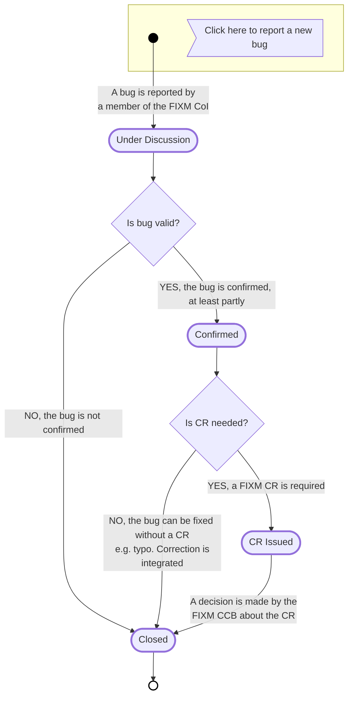
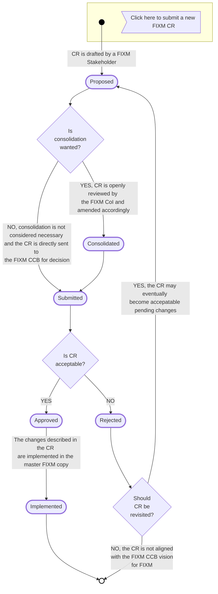
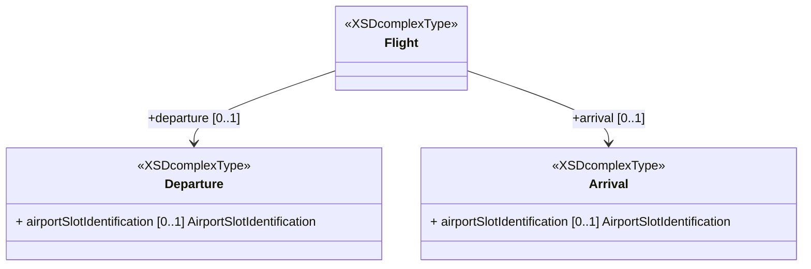

# TEST DIAGRAMS

## CHARTER - BUG

```mermaid
graph TD
INITIAL_STATE(( ))
END_STATE(( ))
UNDER_DISCUSSION([Under Discussion])
CONFIRMED([Confirmed])
CR_ISSUED([CR Issued])
CLOSED([Closed])
is_bug_valid{Is bug valid?}
is_CR_required{Is CR needed?}

INITIAL_STATE --> |A bug is reported by <br>a member of the FIXM CoI| UNDER_DISCUSSION
UNDER_DISCUSSION --> is_bug_valid
is_bug_valid --> |NO, the bug is not confirmed| CLOSED
is_bug_valid --> |YES, the bug is confirmed, at least partly| CONFIRMED
CONFIRMED --> is_CR_required
is_CR_required --> |YES, a FIXM CR is required| CR_ISSUED
is_CR_required --> |NO, the bug can be fixed without a CR<br> e.g. typo. Correction is integrated| CLOSED
CR_ISSUED --> |A decision is made by the <br>FIXM CCB about the CR| CLOSED
CLOSED --> END_STATE

style INITIAL_STATE fill:black,stroke:black,stroke-width:2px
style END_STATE fill:white,stroke:black,stroke-width:2px
style UNDER_DISCUSSION stroke-width:3px
style CONFIRMED stroke-width:3px
style CR_ISSUED stroke-width:3px
style CLOSED stroke-width:3px

subgraph click_here_to_report_a_bug [ ]
INITIAL_STATE
CLICK_HERE>Click here to report a new bug]
end click_here_to_report_a_bug

click CLICK_HERE "https://teams.microsoft.com/l/entity/2a527703-1f6f-4559-a332-d8a7d288cd88/_djb2_msteams_prefix_3974824283?context=%7B%22subEntityId%22%3Anull%2C%22channelId%22%3A%2219%3A1922dacb8fd24c2cb21a0a188d3e8f43%40thread.tacv2%22%7D&groupId=75ac9b42-6d91-445a-98b7-df959b285110&tenantId=76f33c20-5979-4408-adf7-8b3c4be95e52&allowXTenantAccess=false" "Click to report a new bug" _blank
```

## CHARTER - CR

```mermaid
graph TD
INITIAL_STATE(( ))
END_STATE(( ))
PROPOSED([Proposed])
CONSOLIDATED([Consolidated])
SUBMITTED([Submitted])
REJECTED([Rejected])
APPROVED([Approved])
IMPLEMENTED([Implemented])
is_consolidation_wanted{Is<br>consolidation<br>wanted?}
is_CR_acceptable{Is CR<br>acceptable?}
should_CR_be_revisited{Should<br>CR be<br>revisited?}

INITIAL_STATE --> |CR is drafted by a FIXM Stakeholder| PROPOSED
PROPOSED --> is_consolidation_wanted
is_consolidation_wanted --> |NO, consolidation is not considered necessary <br>and the CR is directly sent to <br>the FIXM CCB for decision| SUBMITTED
is_consolidation_wanted --> |YES, CR is openly reviewed by <br>the FIXM CoI and amended accordingly| CONSOLIDATED
CONSOLIDATED --> | | SUBMITTED
SUBMITTED --> | | is_CR_acceptable
is_CR_acceptable --> |NO| REJECTED
is_CR_acceptable --> |YES| APPROVED
APPROVED --> |The changes described in the CR <br>are implemented in the master FIXM copy| IMPLEMENTED
IMPLEMENTED --> END_STATE
REJECTED --> should_CR_be_revisited
should_CR_be_revisited --> |YES, the CR may eventually <br>become accepatable <br>pending changes| PROPOSED
should_CR_be_revisited --> |NO, the CR is not aligned <br>with the FIXM CCB vision <br>for FIXM| END_STATE

style INITIAL_STATE fill:black,stroke:black,stroke-width:2px
style END_STATE fill:white,stroke:black,stroke-width:2px
style PROPOSED stroke-width:3px
style CONSOLIDATED stroke-width:3px
style SUBMITTED stroke-width:3px
style REJECTED stroke-width:3px
style APPROVED stroke-width:3px
style IMPLEMENTED stroke-width:3px

subgraph click_here_to_submit_a_cr [ ]
INITIAL_STATE
CLICK_HERE>Click here to submit a new FIXM CR]
end click_here_to_submit_a_cr

click CLICK_HERE "https://teams.microsoft.com/l/entity/2a527703-1f6f-4559-a332-d8a7d288cd88/_djb2_msteams_prefix_3304927545?context=%7B%22subEntityId%22%3Anull%2C%22channelId%22%3A%2219%3A9a9dc2f87f224a4fac86e8b96b2b1a81%40thread.tacv2%22%7D&groupId=75ac9b42-6d91-445a-98b7-df959b285110&tenantId=76f33c20-5979-4408-adf7-8b3c4be95e52&allowXTenantAccess=false" "Click to issue a new change request" _blank
```

## GUIDANCE - SLOT

```mermaid	
classDiagram	
class Departure
<<XSDcomplexType>> Departure
link Departure "https://www.fixm.aero/releases/FIXM-4.3.0/doc/logical_model_documentation/EARoot/EA1/EA2/EA5/EA311.htm" "Go to definition"	
Departure : + airportSlotIdentification [0..1] AirportSlotIdentification	

class Arrival
<<XSDcomplexType>> Arrival
link Arrival "https://www.fixm.aero/releases/FIXM-4.3.0/doc/logical_model_documentation/EARoot/EA1/EA2/EA2/EA243.htm" "Go to definition"	
Arrival : + airportSlotIdentification [0..1] AirportSlotIdentification	

class Flight
<<XSDcomplexType>> Flight
Flight --> Departure : +departure [0..1]
Flight --> Arrival : +arrival [0..1]
```

