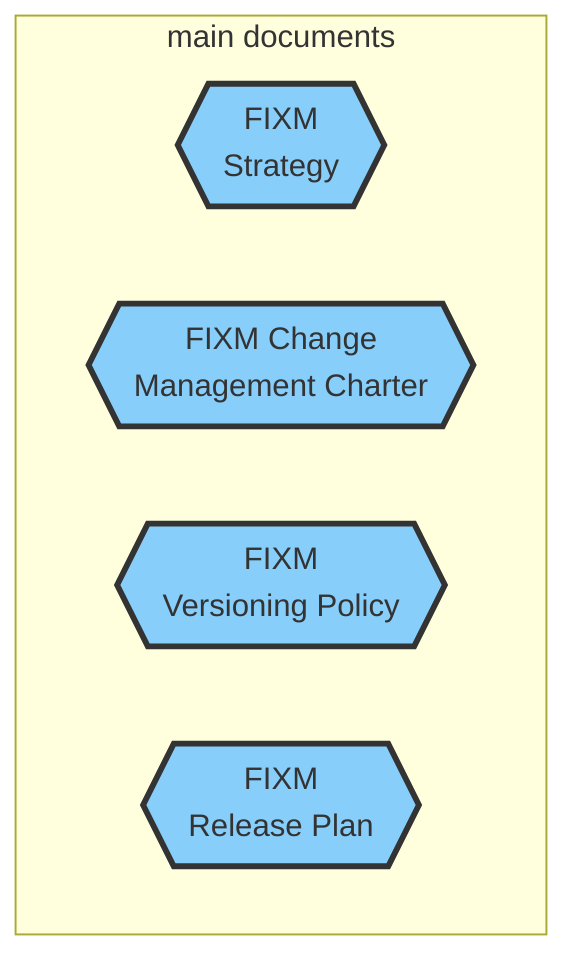

# Welcome to the FIXM User Manual

The FIXM User Manual, formerly known as Implementation Guidance, is developed and maintained by the FIXM Community. Content has been subject to FIXM CCB review and endorsement and is therefore the official recommendation of the FIXM CCB. 

Note: The content of the FIXM User Manual is informative. The use of the words *shall* or *required* indicates a requirement to be strictly followed in order to conform to this guidance. The use of the words *should* or *recommended* indicates that there may may be valid reasons, in particular circumstances, to ignore a particular aspect of the guidance.

## Guidance on FIXM Releases

This edition of the FIXM User Manual provides guidance for [FIXM Core 4.2.0](https://fixm.aero/release.pl?rel=FIXM-4.2.0), the [FF-ICE Application 1.0.0](https://fixm.aero/release.pl?rel=FFICE-Msg-1.0.0) and the [Basic Application 1.0.0](https://fixm.aero/release.pl?rel=Basic-Msg-1.0.0).

Guidance for previous releases is available on [FIXM.aero](https://www.fixm.aero).

## Content and Target audience
...

## Contribute
...

### How to get access to the FIXM Work Area

1. Create a OneSky Online account (This step can be skipped if you have already an account) : Access [OneSky Online][OneSky Online], click on *New user? Register now.*, fill in the form and click on *Submit*
2. Get access to OneSky Teams: Access [OneSky Teams][OneSky Teams], and log in with your credentials obtained in Step 1
3. Request access to the FIXM Work Area: Click on *All Teams* in the top navigation, browse for the FIXM Work Area and click on its title, click on *Access can be requested via this link*, and send the access request.
4. You will then receive an email when the request is approved, with the link to the FIXM Work Area

## How to use this web site

- Use the side bar opposite to access the various sections of the FIXM User Manual;
- Use the search engine to look for a specific entry;
- Use the buttons *< Previous* and *Next >* at the bottom of each page to navigate across the different sections of the manual.
